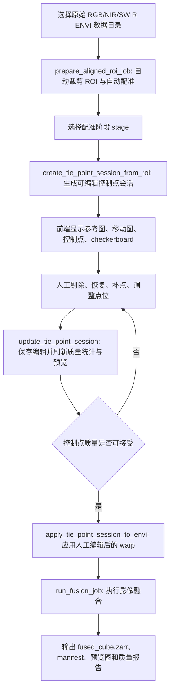

# M0-1 高光谱-光学影像融合算法模块后端 API 与前端交互说明

## 1. 模块定位

M0-1 模块负责岩心 RGB 可见光影像、NIR 近红外高光谱影像、SWIR 短波红外高光谱影像的配准、交互式控制点修正与融合输出。

当前后端算法模块已经支持：

- 自动 ROI 裁剪与粗配准。
- ENVI 风格的 tie points + 局部 warp 自动配准。
- tie points 可视化。
- 前端人工剔除控制点、恢复控制点、补充控制点、修改控制点。
- 根据人工编辑后的有效控制点重建局部 warp 模型。
- 将编辑后的控制点模型应用到 ENVI 数据。
- 执行 4 种融合方法：`upsample_only`、`fast_preview`、`classical`、`deep_unsupervised`。
- 输出标准化融合产品：`fused_cube.zarr`、`manifest.json`、质量报告、波段元数据、预览图。

模块源码位于：

```text
D:\Code\Geocore_M0-1_image_fusion\src\geocore_m01_fusion
```

## 2. 推荐整体工作流



## 3. 输入数据

### 3.1 原始输入目录

输入目录应包含 3 组 ENVI 文件：

```text
RGB-*.hdr
RGB-*.dat
NIR-*.hdr
NIR-*.dat
SWIR-*.hdr
SWIR-*.dat
```

示例：

```text
E:\Experiment_data\2026 岩心高光谱数据\...\2023_09_09_14_18_58-ZKH3号-132-140-0.0_0.0-0.0_0.0
```

当前样例数据尺寸：

| 传感器 | 空间尺寸 | 波段数 | 数据类型 |
| --- | ---: | ---: | --- |
| RGB | 22480 x 2048 | 3 | uint8 |
| NIR | 4292 x 320 | 341 | float64 |
| SWIR | 4341 x 320 | 212 | float64 |

### 3.2 已配准 ROI 输入

ROI 生成后，默认输出：

```text
roi_outputs\<roi_name>\
  aligned_envi\
    RGB_aligned_roi.hdr
    RGB_aligned_roi.dat
    NIR_aligned_roi.hdr
    NIR_aligned_roi.dat
    SWIR_aligned_roi.hdr
    SWIR_aligned_roi.dat
  previews\
  roi_manifest.json
```

前端交互式控制点编辑主要基于 `roi_manifest.json` 和 `aligned_envi` 下的 ROI 数据。

## 4. 输出数据

### 4.1 ROI 配准输出

`prepare_aligned_roi_job` 输出一个 `roi_manifest.json`，包含：

- 原始 RGB/NIR/SWIR 尺寸。
- RGB 裁剪窗口。
- NIR/SWIR 裁剪窗口。
- 自动配准模型。
- 每个配准阶段的 tie points。
- 预览图路径。
- 对齐后的 ENVI ROI 文件路径。

重要字段：

```json
{
  "schema_version": "m0_aligned_roi.v1",
  "registration_mode": "scale_only",
  "local_warp": true,
  "final_hsi_rgb_warp": true,
  "crop_rgb_window": {
    "rgb_y0": 9560,
    "rgb_y1": 10328,
    "rgb_x0": 888,
    "rgb_x1": 1400,
    "height": 768,
    "width": 512
  },
  "warp_models": {
    "swir_to_rgb_lowres": {},
    "nir_to_swir_lowres": {},
    "joint_hsi_to_rgb_lowres_final": {}
  }
}
```

### 4.2 控制点会话输出

`create_tie_point_session_from_roi` 输出：

```text
tiepoint_sessions\<stage>\
  session.json
  previews\
    <stage>_tiepoints_side_by_side.png
    <stage>_reference_points.png
    <stage>_moving_points.png
    <stage>_checkerboard.png
    <stage>_context_side_by_side.png
    <stage>_context_reference_points.png
    <stage>_context_moving_points.png
```

其中 `session.json` 是前端交互编辑的核心数据。

说明：

- `tiepoints_side_by_side`、`reference_points`、`moving_points`、`checkerboard` 使用的是算法配准结构图，通常是低分辨率灰度图或边缘/强度组合图，看起来会比真实岩心影像更抽象。
- `context_side_by_side`、`context_reference_points`、`context_moving_points` 使用真实 RGB ROI 和高光谱伪彩色上下文图，更适合前端展示给人工判读。
- 前端推荐默认显示 `context_*` 预览，把结构图预览作为高级调试视图。

### 4.3 融合输出

融合任务输出：

```text
fusion_output\
  manifest.json
  fused_cube.zarr
  metadata\
    band_metadata.csv
    input_metadata.json
    processing_config.json
    registration_model.json
    spectral_stitch_model.json
  metrics\
    quality_report.json
  previews\
    preview_rgb.png
```

`fused_cube.zarr` 是主输出数据，坐标网格对齐 RGB，shape 为：

```text
[RGB高度, RGB宽度, NIR波段数 + SWIR波段数]
```

当前样例 ROI 的输出 shape：

```text
[768, 512, 553]
```

## 5. 配准阶段 stage

前端需要让用户选择或展示以下配准阶段：

| stage | 参考图 reference | 移动图 moving | 作用 |
| --- | --- | --- | --- |
| `swir_to_rgb_lowres` | RGB 低分辨率结构图 | SWIR 结构图 | SWIR 到 RGB 网格的局部配准 |
| `nir_to_swir_lowres` | 已配准 SWIR 结构图 | NIR 结构图 | NIR 到 SWIR 的内部对齐 |
| `joint_hsi_to_rgb_lowres_final` | RGB 低分辨率结构图 | NIR+SWIR 联合高光谱结构图 | 最终 HSI 到 RGB 的精配准 |

推荐前端默认优先展示 `joint_hsi_to_rgb_lowres_final`，因为它直接影响最终融合影像与 RGB 的细微对齐。

## 6. 后端 Python 服务函数

这些函数位于：

```python
geocore_m01_fusion.api_service
```

主后端可以在 Django/FastAPI/Flask 中直接调用这些函数。

### 6.1 查询模块能力

```python
from geocore_m01_fusion import available_api_operations

result = available_api_operations()
```

返回：

```json
{
  "module": "M0-1",
  "api_version": "m0_fusion_api.v1",
  "workflows": [
    "prepare_aligned_roi",
    "create_tie_point_session",
    "edit_tie_point_session",
    "apply_tie_point_session_to_envi",
    "run_fusion"
  ],
  "tie_point_operations": ["add", "update", "reject", "delete", "activate", "restore"],
  "fusion_modes": ["upsample_only", "fast_preview", "classical", "deep_unsupervised"]
}
```

### 6.2 自动裁剪 ROI 与自动配准

```python
from geocore_m01_fusion import prepare_aligned_roi_job

result = prepare_aligned_roi_job(
    root=r"E:\Experiment_data\...\raw_triplet_dir",
    output_dir=r"D:\Code\Geocore_M0-1_image_fusion\roi_outputs\ZKH3_roi",
    crop_height=768,
    crop_width=512,
    local_warp=True,
    final_hsi_rgb_warp=True,
)
```

输出是 ROI manifest 字典，同时写入 `roi_manifest.json`。

### 6.3 从 ROI 创建控制点会话

```python
from geocore_m01_fusion import create_tie_point_session_from_roi

result = create_tie_point_session_from_roi(
    roi_dir=r"D:\Code\Geocore_M0-1_image_fusion\roi_outputs\ZKH3_roi",
    stage="joint_hsi_to_rgb_lowres_final",
)
```

返回：

```json
{
  "session_path": "...\tiepoint_sessions\joint_hsi_to_rgb_lowres_final\session.json",
  "session": {},
  "preview_paths": {
    "side_by_side": "...png",
    "reference_overlay": "...png",
    "moving_overlay": "...png",
    "checkerboard": "...png",
    "context_side_by_side": "...png",
    "context_reference_overlay": "...png",
    "context_moving_overlay": "...png"
  }
}
```

### 6.4 前端编辑控制点

```python
from geocore_m01_fusion import update_tie_point_session

result = update_tie_point_session(
    session_path=r"...\session.json",
    operations=[
        {"op": "reject", "id": "tp_0001"},
        {
            "op": "add",
            "ref_y": 74.0,
            "ref_x": 46.0,
            "moving_y": 74.0,
            "moving_x": 45.0,
            "score": 1.0,
            "note": "manual point from frontend"
        }
    ],
)
```

后端会：

- 修改 `session.json`。
- 重新计算质量统计。
- 重新渲染预览图。
- 返回更新后的 session。

### 6.5 应用编辑后的控制点到 ENVI 数据

```python
from geocore_m01_fusion import apply_tie_point_session_to_envi

result = apply_tie_point_session_to_envi(
    session_path=r"...\session.json",
    input_hdr=r"...\NIR_aligned_roi.hdr",
    input_dat=r"...\NIR_aligned_roi.dat",
    output_hdr=r"...\NIR_manual_warped_roi.hdr",
    output_dat=r"...\NIR_manual_warped_roi.dat",
)
```

返回：

```json
{
  "output_hdr": "...hdr",
  "output_dat": "...dat",
  "registration_model": "...registration_model.json",
  "quality": {},
  "model": {}
}
```

注意：如果编辑的是 `joint_hsi_to_rgb_lowres_final`，为了保持 NIR/SWIR 内部一致，实际业务中应把同一个 session 分别应用到 NIR 和 SWIR。

### 6.6 执行融合

```python
from geocore_m01_fusion import run_fusion_job

result = run_fusion_job(
    rgb_hdr=r"...\RGB_aligned_roi.hdr",
    rgb_dat=r"...\RGB_aligned_roi.dat",
    nir_hdr=r"...\NIR_aligned_roi.hdr",
    nir_dat=r"...\NIR_aligned_roi.dat",
    swir_hdr=r"...\SWIR_aligned_roi.hdr",
    swir_dat=r"...\SWIR_aligned_roi.dat",
    output_dir=r"...\fusion_classical",
    mode="classical",
    streaming=True,
    chunk_size=(256, 256, 32),
    spatial_detail_strength=0.42,
    spatial_detail_small_radius=2,
    spatial_detail_large_radius=9,
)
```

## 7. 建议 REST API 设计

算法模块本身不强绑定 Web 框架。主后端可以按以下 REST 契约封装。

### 7.1 获取模块能力

```http
GET /api/m0-1/capabilities
```

响应直接来自 `available_api_operations()`。

### 7.2 准备 ROI

```http
POST /api/m0-1/roi
Content-Type: application/json
```

请求：

```json
{
  "root": "E:\\Experiment_data\\...\\raw_triplet_dir",
  "output_dir": "D:\\Code\\Geocore_M0-1_image_fusion\\roi_outputs\\ZKH3_roi",
  "crop_height": 768,
  "crop_width": 512,
  "local_warp": true,
  "final_hsi_rgb_warp": true
}
```

响应：

```json
{
  "roi_manifest": {},
  "roi_manifest_path": "...\\roi_manifest.json"
}
```

### 7.3 创建控制点会话

```http
POST /api/m0-1/tiepoint-sessions
Content-Type: application/json
```

请求：

```json
{
  "roi_dir": "D:\\Code\\Geocore_M0-1_image_fusion\\roi_outputs\\ZKH3_roi",
  "stage": "joint_hsi_to_rgb_lowres_final"
}
```

响应：

```json
{
  "session_path": "...\\session.json",
  "session": {},
  "preview_paths": {
    "side_by_side": "...png",
    "reference_overlay": "...png",
    "moving_overlay": "...png",
    "checkerboard": "...png"
  }
}
```

### 7.4 获取控制点会话

```http
GET /api/m0-1/tiepoint-sessions/{session_id}
```

建议后端通过数据库或文件索引把 `session_id` 映射到 `session_path`，然后返回 `session.json`。

### 7.5 编辑控制点

```http
PATCH /api/m0-1/tiepoint-sessions/{session_id}
Content-Type: application/json
```

请求：

```json
{
  "operations": [
    {"op": "reject", "id": "tp_0001"},
    {"op": "restore", "id": "tp_0040"},
    {
      "op": "add",
      "ref_y": 74.0,
      "ref_x": 46.0,
      "moving_y": 74.0,
      "moving_x": 45.0,
      "score": 1.0,
      "note": "manual tie point"
    }
  ],
  "render_preview": true
}
```

响应：

```json
{
  "changed_point_ids": ["tp_0001", "tp_0040", "new_uuid"],
  "quality": {},
  "preview_paths": {},
  "session": {}
}
```

### 7.6 应用控制点会话

```http
POST /api/m0-1/tiepoint-sessions/{session_id}/apply
Content-Type: application/json
```

请求：

```json
{
  "input_hdr": "...\\NIR_aligned_roi.hdr",
  "input_dat": "...\\NIR_aligned_roi.dat",
  "output_hdr": "...\\NIR_manual_warped_roi.hdr",
  "output_dat": "...\\NIR_manual_warped_roi.dat",
  "min_active_points": 3
}
```

响应：

```json
{
  "output_hdr": "...hdr",
  "output_dat": "...dat",
  "registration_model": "...registration_model.json",
  "quality": {},
  "model": {}
}
```

### 7.7 执行融合

```http
POST /api/m0-1/fusion-jobs
Content-Type: application/json
```

请求：

```json
{
  "rgb_hdr": "...\\RGB_aligned_roi.hdr",
  "rgb_dat": "...\\RGB_aligned_roi.dat",
  "nir_hdr": "...\\NIR_aligned_roi.hdr",
  "nir_dat": "...\\NIR_aligned_roi.dat",
  "swir_hdr": "...\\SWIR_aligned_roi.hdr",
  "swir_dat": "...\\SWIR_aligned_roi.dat",
  "output_dir": "...\\fusion_classical",
  "mode": "classical",
  "streaming": true,
  "chunk_size": [256, 256, 32],
  "spatial_detail_strength": 0.42,
  "spatial_detail_small_radius": 2,
  "spatial_detail_large_radius": 9
}
```

响应：

```json
{
  "output_dir": "...\\fusion_classical",
  "manifest": {},
  "quality_report": {}
}
```

## 8. 控制点 session.json 格式

核心结构：

```json
{
  "schema_version": "m0_tie_point_session.v1",
  "session_id": "65cefef0-446a-4d48-9930-a008fbd7034d",
  "stage": "joint_hsi_to_rgb_lowres_final",
  "reference_name": "RGB low-resolution structure",
  "moving_name": "Joint NIR+SWIR HSI structure",
  "reference_shape": [149, 81],
  "moving_shape": [149, 81],
  "approx_offset_y": 0.0,
  "approx_offset_x": 0.0,
  "approx_scale_y": 1.0,
  "approx_scale_x": 1.0,
  "quality": {
    "total_count": 54,
    "active_count": 33,
    "rejected_count": 21,
    "deleted_count": 0,
    "manual_count": 0,
    "mean_score": 0.334,
    "median_delta_y": 0.0,
    "median_delta_x": 0.0,
    "warnings": []
  },
  "points": []
}
```

单个控制点：

```json
{
  "id": "tp_0001",
  "ref_y": 25.0,
  "ref_x": 46.0,
  "moving_y": 24.0,
  "moving_x": 46.0,
  "approx_y": 25.25,
  "approx_x": 46.2,
  "delta_y": -1.25,
  "delta_x": -0.2,
  "score": 0.432,
  "status": "active",
  "source": "auto",
  "note": ""
}
```

字段说明：

| 字段 | 含义 |
| --- | --- |
| `ref_y/ref_x` | 参考图坐标，单位是当前 stage 的参考图像素 |
| `moving_y/moving_x` | 移动图坐标，单位是当前 stage 的移动图像素 |
| `approx_y/approx_x` | 粗映射预测的移动图坐标 |
| `delta_y/delta_x` | 控制点局部位移 |
| `score` | 自动匹配分数，人工点可设为 `1.0` |
| `status` | `active`、`rejected`、`deleted` |
| `source` | `auto`、`auto_rejected`、`manual` |
| `note` | 前端或人工质检备注 |

## 9. 前端交互建议

### 9.1 必备视图

前端至少需要实现 4 个区域：

- 参考图视图：默认显示 `context_reference_overlay`，高级调试时显示 `reference_overlay`。
- 移动图视图：默认显示 `context_moving_overlay`，高级调试时显示 `moving_overlay`。
- 双窗口连线视图：默认显示 `context_side_by_side`，高级调试时显示 `side_by_side`。
- 配准效果视图：显示 `checkerboard`，用于判断局部 warp 后是否仍有错位。

### 9.2 控制点颜色建议

后端预览图已经采用以下颜色：

| 类型 | 颜色含义 |
| --- | --- |
| 自动有效点 `auto + active` | 青色 |
| 自动剔除点 `auto_rejected + rejected` | 橙色 |
| 人工点 `manual + active` | 黄色 |
| 删除点 `deleted` | 不显示 |

### 9.3 推荐操作

前端应支持：

- 点击控制点，查看坐标、score、delta、source、status。
- 勾选或框选多个控制点，批量 reject。
- 恢复被 reject 的控制点。
- 删除错误点，删除后默认不参与可视化。
- 在参考图点选一个位置，再在移动图点选对应位置，新增人工控制点。
- 拖动已有控制点并提交 `update` 操作。
- 显示质量统计：有效点数、人工点数、平均 score、位移标准差、warnings。
- 每次编辑后刷新预览图和质量统计。

## 10. 控制点编辑操作协议

### 10.1 reject

```json
{"op": "reject", "id": "tp_0001"}
```

作用：该点不参与 warp，但仍保留在会话中并可恢复。

### 10.2 restore 或 activate

```json
{"op": "restore", "id": "tp_0001"}
```

作用：重新启用一个控制点。

### 10.3 delete

```json
{"op": "delete", "id": "tp_0001"}
```

作用：标记为 deleted，不参与 warp，预览图不显示。后端不会物理删除记录，方便审计。

### 10.4 add

```json
{
  "op": "add",
  "ref_y": 74.0,
  "ref_x": 46.0,
  "moving_y": 74.0,
  "moving_x": 45.0,
  "score": 1.0,
  "note": "manual tie point"
}
```

作用：新增人工控制点。

### 10.5 update

```json
{
  "op": "update",
  "id": "tp_0001",
  "ref_y": 25.0,
  "ref_x": 46.0,
  "moving_y": 24.5,
  "moving_x": 45.8,
  "note": "adjusted manually"
}
```

作用：修改控制点坐标或备注。

## 11. 质量控制建议

后端会返回 `quality.warnings`，前端需要醒目展示。

推荐判断规则：

- `active_count < 8`：控制点数量偏少，局部 warp 不稳定。
- `mean_score < 0.08`：自动匹配质量偏低，需要人工检查。
- `delta_y_std` 或 `delta_x_std` 明显过大：可能存在离群点，应优先检查大位移点。
- 人工点应覆盖 ROI 上、中、下以及左右边界，不要只集中在局部。

配准确认前，建议用户至少检查：

- `roi_overlay_rgb_nir.png`
- `roi_overlay_rgb_swir.png`
- `roi_overlay_nir_swir.png`
- 当前 stage 的 `checkerboard.png`

## 11.1 四种融合模式的当前定位

| mode | 当前实现 | 适用场景 |
| --- | --- | --- |
| `upsample_only` | 只做辐射拼接与几何上采样，不注入 RGB 高频 | 最低基线、几何/光谱输出检查 |
| `fast_preview` | RGB 亮度多尺度高频残差快速注入 | 快速预览、人工检查空间细节 |
| `classical` | 低秩光谱基 + RGB 边缘约束 + 多尺度高频保持 | 当前生产主线 |
| `deep_unsupervised` | 无监督低秩 autoencoder 原型 + RGB 高频保持 | 高质量增强研究入口，当前仍非训练深度模型 |

空间细节相关参数：

| 参数 | 默认值 | 说明 |
| --- | ---: | --- |
| `fast_detail_strength` | `0.26` | fast_preview 的快速细节调制强度 |
| `classical_detail_strength` | `0.12` | classical 低秩系数引导强度 |
| `deep_detail_strength` | `0.10` | deep_unsupervised 迭代潜变量引导强度 |
| `spatial_detail_strength` | `0.42` | RGB 多尺度高频残差注入主强度 |
| `spatial_detail_small_radius` | `2` | 细尺度高通半径 |
| `spatial_detail_large_radius` | `9` | 中尺度高通半径 |

## 12. 命令行调试

### 12.1 查询 API 能力

```powershell
$env:PYTHONPATH='D:\Code\Geocore_M0-1_image_fusion\src'
D:\Users\anaconda\envs\geomanager\python.exe -m geocore_m01_fusion.tiepoints_cli api-summary
```

### 12.2 创建控制点会话

```powershell
D:\Users\anaconda\envs\geomanager\python.exe -m geocore_m01_fusion.tiepoints_cli create-session `
  --roi-dir "roi_outputs\ZKH3_132_140_roi_768x512_final_hsi_rgb_warp" `
  --stage joint_hsi_to_rgb_lowres_final
```

### 12.3 编辑控制点会话

```powershell
D:\Users\anaconda\envs\geomanager\python.exe -m geocore_m01_fusion.tiepoints_cli edit-session `
  --session "roi_outputs\ZKH3_132_140_roi_768x512_final_hsi_rgb_warp\tiepoint_sessions\joint_hsi_to_rgb_lowres_final\session.json" `
  --operations-json '[{"op":"reject","id":"tp_0001"}]'
```

### 12.4 应用控制点会话

```powershell
D:\Users\anaconda\envs\geomanager\python.exe -m geocore_m01_fusion.tiepoints_cli apply-session `
  --session "...\session.json" `
  --input-hdr "...\NIR_aligned_roi.hdr" `
  --input-dat "...\NIR_aligned_roi.dat" `
  --output-hdr "...\NIR_manual_warped_roi.hdr" `
  --output-dat "...\NIR_manual_warped_roi.dat"
```

## 13. 当前实现文件

| 文件 | 功能 |
| --- | --- |
| `registration.py` | 自动 tie points、局部 IDW warp、双线性采样 |
| `roi.py` | ROI 裁剪、SWIR/RGB、NIR/SWIR、联合 HSI/RGB 多阶段配准 |
| `tiepoints.py` | 可编辑控制点会话、人工编辑、质量统计、预览图渲染 |
| `api_service.py` | 可供 Web 后端调用的服务函数 |
| `tiepoints_cli.py` | 本地调试 CLI |
| `pipeline.py` | 融合管线入口 |
| `streaming.py` | 大数据 out-of-core 融合 |
| `algorithms.py` | 四种融合算法 |

## 14. 前端集成注意事项

- 前端坐标必须使用图像原始像素坐标，不要使用缩放后屏幕坐标直接提交。
- 如果前端显示图像有缩放，需要将屏幕坐标反算回 `reference_shape` 或 `moving_shape` 对应坐标。
- 新增人工点时，必须先选参考图点，再选移动图对应点。
- 对 `joint_hsi_to_rgb_lowres_final` 阶段应用人工 warp 时，NIR 和 SWIR 应使用同一个 session 分别输出，避免破坏二者内部对齐。
- 融合输出主格式是 Zarr，不建议把大尺寸融合结果强制导出为一个巨大的 `.dat` 文件作为主格式。
- ENVI `.dat/.hdr` 仅作为兼容交换格式和 ROI 调试格式。

## 15. 后续可扩展方向

- 前端增加控制点表格，支持按 score、delta、source、status 排序。
- 增加局部放大镜视图，辅助人工补点。
- 增加 rubber-sheet 网格形变可视化，显示局部 warp 形变场。
- 增加保存多个 session 版本的功能，方便比较不同人工修正方案。
- 增加 RMSE 或重投影误差统计，给人工点和自动点分别计算质量分数。
- 将长耗时 ROI 和融合任务接入异步任务队列，前端通过 job id 查询进度。
