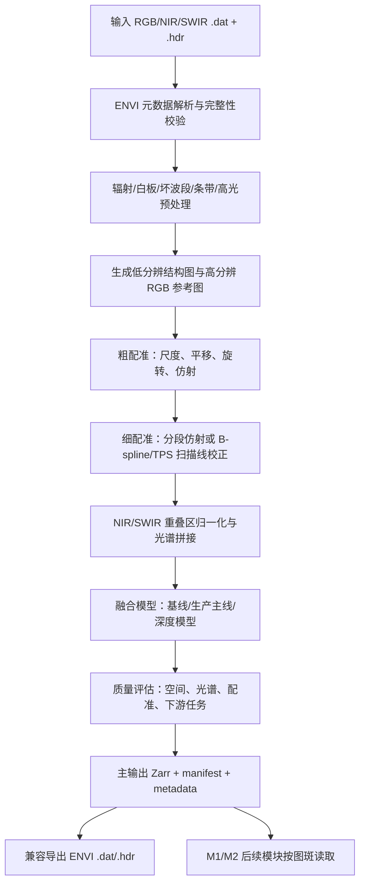

# M0-1 高光谱-光学影像融合算法模块设计方案

版本：v1.0  
日期：2026-06-15  
适用项目：Geo-Core AI V2.1 岩心智能编录软件  
模块定位：数据预处理阶段前置核心算法模块，服务于后续 M1-1 岩心箱旋转校正、M1-2 岩心柱体前景掩膜、M1-3 岩心柱体分割与深度标记，以及 M2-6 矿物识别、M2-5 岩性识别等高光谱依赖模块。

---

## 1. 设计目标

M0-1 模块的目标是将同一岩心箱采集得到的高空间分辨率 RGB/可见光影像、近红外高光谱影像 NIR、短波红外高光谱影像 SWIR 进行统一预处理、配准、光谱拼接和融合，生成一套兼具高空间分辨率与高光谱分辨率的标准化融合成果。

本模块不是简单的 RGB 锐化，也不是把 RGB 纹理强行叠加到每一个高光谱波段，而是采用“光谱守恒的 RGB 引导高光谱超分辨融合”思路：

- RGB 影像提供岩心纹理、裂隙、颗粒边界、箱体结构等高空间分辨率信息。
- NIR/SWIR 影像提供矿物、蚀变、水羟基、碳酸盐、黏土矿物等关键光谱吸收信息。
- 融合过程必须尽量提升空间清晰度，同时严格约束光谱形态，避免破坏矿物识别需要的吸收峰、连续谱形态和反射率比例关系。

最终交付成果应满足三个层次的使用需求：

1. 后端算法高效读取：支持按图斑、按空间块、按波段块随机访问。
2. 前端交互快速预览：支持 RGB、伪彩色、卷帘对比、光谱曲线对比。
3. 外部软件兼容：支持导出 ENVI `.dat + .hdr`，便于 ENVI、QGIS、MATLAB、Python 光谱分析工具读取。

---

## 2. 样例数据与约束

以当前项目样例路径中的数据为代表：

```text
E:\Experiment_data\2026 岩心高光谱数据\
2023_09_09_14_18_58-ZKH3号-132-140-0.0_0.0-0.0_0.0\
2023_09_09_14_18_58-ZKH3号-132-140-0.0_0.0-0.0_0.0\
```

典型输入包括：

| 数据 | 样例文件 | 空间尺寸 | 波段数 | 数据类型 | 波长范围 | ENVI interleave |
|---|---|---:|---:|---|---|---|
| RGB/可见光 | `RGB-20230909_141858-00000.dat/.hdr` | 2048 x 22480 | 3 | uint8 | 未标定 RGB | BIL |
| NIR | `NIR-20230909_141902-00000.dat/.hdr` | 320 x 4292 | 341 | float64 | 691-1482 nm | BIL |
| SWIR | `SWIR-20230909_141858-00000.dat/.hdr` | 320 x 4341 | 212 | float64 | 979-2518 nm | BIL |

由此可见：

- RGB 空间分辨率约为 NIR/SWIR 的 5-6 倍。
- NIR 与 SWIR 存在 979-1482 nm 的光谱重叠区，可以用于跨传感器增益校正与拼接一致性检查。
- NIR/SWIR 行数不完全一致，说明不同传感器可能存在扫描速度、起止位置或几何畸变差异，不能假定三者已经严格像素对齐。
- 融合到 RGB 尺度后，如果输出 `2048 x 22480 x 约553 bands x float32`，未压缩体积约 95 GiB；若使用 float64 则接近 190 GiB。因此必须采用分块、压缩、可随机访问的主存储格式。

---

## 3. 总体技术路线

推荐模块采用三层算法体系：

1. 快速基线层：用于快速预览、调试、验收对比。
2. 生产主线层：用于项目默认融合成果，强调稳健、可解释、光谱保真。
3. 深度增强层：用于后续研究和高质量模式，逐步引入无监督深度模型或物理约束深度网络。

建议命名为 `GC-HyFuse`，即 Geometry-constrained Hyperspectral Fusion。

总体流程如下：



---

## 4. 输入数据规范

### 4.1 必需输入

每个融合任务最少需要：

- RGB/高分辨率光学影像：`.dat + .hdr`、`.tif`、`.jpg`、`.png` 之一。
- NIR 高光谱影像：`.dat + .hdr`。
- SWIR 高光谱影像：`.dat + .hdr`。
- 任务元数据：钻孔号、箱号或回次、顶深、底深、采集时间、数据目录。

### 4.2 可选输入

- M1-2 已有前景掩膜：若已经提前生成，可用于融合时排除木箱、标签纸、黑边和背景区域。
- 白板/暗电流文件：若 `.hdr` 中记录的标定文件可访问，则用于重新检查或补做反射率校正。
- 色卡/标尺区域：用于 RGB 白平衡、像素-毫米尺度估计和质量控制。
- 手工控制点：用于复杂样本的配准纠偏。

### 4.3 数据完整性检查

模块启动后必须检查：

- `.dat` 文件大小是否与 `.hdr` 中 `samples x lines x bands x dtype` 一致。
- `interleave` 是否支持，首期重点支持 BIL、BSQ、BIP。
- `byte order`、`header offset`、`data type` 是否可解析。
- 波长数组长度是否等于 `bands`。
- NIR/SWIR 是否存在足够重叠波长区。
- 数据是否存在 NaN、Inf、全零行、异常条带、饱和高光。

---

## 5. 预处理流程

### 5.1 反射率与辐射一致性处理

岩心实验室扫描不同于卫星遥感，一般不需要大气校正。这里应将“大气校正”落地为实验室影像校正：

- 暗电流校正。
- 白板反射率校正。
- 光照不均匀校正。
- 高光/饱和区域标记。
- 坏线、坏列、坏波段检测。
- 条带噪声抑制。
- RGB 白平衡与亮度归一化。

如果 `.hdr` 中 `Is Reflect: True`，则默认输入已经是反射率或近似反射率，但仍要做范围检查和异常值裁剪。建议内部统一到 `float32 reflectance`，反射率范围原则上保持 `[0, 1]`，异常值可在质量掩膜中标记，不建议直接粗暴截断所有异常。

### 5.2 波段筛选与坏波段标记

NIR/SWIR 中可能存在低信噪比波段、水汽或设备边缘波段。输出时不要简单删除所有坏波段，而应在 `band_metadata.csv` 中标记：

- `is_bad_band`
- `bad_reason`
- `snr_estimate`
- `recommended_for_mineral`
- `recommended_for_visualization`

这样后续 M2-6 矿物识别可以主动跳过坏波段，同时保留原始波长索引用于追溯。

### 5.3 NIR/SWIR 光谱拼接

NIR 与 SWIR 在约 979-1482 nm 存在重叠。建议流程：

1. 在前景岩心区域内采样稳定像元，避开高光、阴影、标签纸和箱体。
2. 对 NIR 与 SWIR 重叠波段做稳健回归，估计 SWIR 到 NIR 反射率尺度的增益与偏置。
3. 在重叠区使用波长相关权重平滑拼接。
4. 输出统一波长序列，并记录每个融合波段来自 NIR、SWIR 或 overlap blend。

拼接质量指标：

- 重叠区平均反射率差。
- 重叠区光谱角 SAM。
- 关键吸收峰位置偏移。
- 拼接边界一阶差分突变。

---

## 6. 几何配准方案

### 6.1 参考坐标系

所有融合成果以 RGB 影像坐标作为高分辨率参考网格：

```text
origin: RGB 左上角
x: 列方向，向右为正
y: 行方向，向下为正
unit: pixel
grid_shape: [rgb_height, rgb_width]
```

后续 M1-1、M1-2、M1-3 的所有 ROI、mask、bbox、深度切割线都应默认落在该参考网格上。

### 6.2 配准对象

RGB 与 NIR/SWIR 光谱差异很大，不建议直接用某一个高光谱波段配准。建议生成结构图：

- RGB 结构图：灰度亮度、边缘梯度、CLAHE 增强图。
- NIR 结构图：剔除坏波段后的中位数/均值图、局部对比增强图。
- SWIR 结构图：稳定波段组合的均值图、纹理图。
- 掩膜辅助图：若有前景掩膜，则只在岩心区域估计变换。

### 6.3 配准模型

建议采用由简到繁的分层配准：

1. 粗配准：尺度、平移、旋转。
2. 仿射配准：处理传感器安装角度和比例差。
3. 分段仿射或薄板样条 TPS：处理扫描方向局部拉伸。
4. B-spline 或行方向一维非线性校正：处理线扫速度导致的局部错位。

配准质量要求：

- 前景岩心区域重投影误差建议 `<= 0.3` 个低分辨像元，或 `<= 2` 个 RGB 像元。
- 控制点残差、边缘重合度和互信息指标都要进入 `quality_report.json`。
- 失败时允许进入人工控制点修正流程。

---

## 7. 融合算法设计

### 7.1 算法分级

建议提供如下模式：

| 模式 | 名称 | 作用 | 速度 | 光谱保真 | 推荐用途 |
|---|---|---|---|---|---|
| `upsample_only` | 空间重采样基线 | 最低基线 | 快 | 高 | 消融实验、质量对照 |
| `fast_preview` | RGB 引导滤波/NNDiffuse 改造 | 快速预览 | 快 | 中 | 前端卷帘预览 |
| `classical` | 低秩光谱基 + RGB 边缘约束 | 生产主线 | 中 | 高 | 默认输出 |
| `deep_unsupervised` | 无监督模型启发 autoencoder | 高质量增强 | 慢 | 高 | 专项实验 |
| `deep_unrolled` | 物理约束展开网络 | 研究版 | 中-慢 | 高 | 后续研究 |

### 7.2 基线模型 1：空间重采样基线

这是必须保留的最低基线，不引入 RGB 光谱信息，只将 NIR/SWIR 配准后上采样到 RGB 网格。

方法：

- 最近邻：用于严格不改变原始光谱值的保守模式。
- 双线性/三次卷积：用于视觉平滑预览。
- Lanczos：用于空间质量对照。

用途：

- 作为所有融合模型的光谱保真参考。
- 计算融合模型是否引入过度锐化或伪影。
- 支持快速调试配准和数据读取。

### 7.3 基线模型 2：RGB 引导滤波与 NNDiffuse 改造

NNDiffuse 是 ENVI 中常见的图像锐化思路，适合将高分辨率影像的局部空间结构扩散到低分辨率多波段数据中。原始 NNDiffuse 对严格对齐和整数分辨率比例有要求，而岩心数据往往存在非整数比例、行数不一致和线扫畸变，因此需要做岩心场景改造：

- 支持非整数尺度比例。
- 支持配准模型的反向映射。
- 只在岩心前景区域注入纹理。
- 限制 RGB 边缘对无关 SWIR 吸收波段的过度影响。
- 对标签纸、木箱边缘、高光区域使用质量掩膜抑制。

该模式适合作为 `fast_preview`，不建议作为最终默认成果。

### 7.4 生产主线模型：低秩光谱基 + RGB 边缘约束

推荐默认生产模型采用低秩光谱表示：

```text
X = A E^T
```

其中：

- `X`：RGB 高分辨率网格上的目标融合高光谱立方体。
- `E`：从 NIR/SWIR 原始高光谱数据中学习到的光谱基。
- `A`：高分辨率空间系数图或丰度图。

优化目标：

```text
min_A || D B (A E^T) - Y ||^2
    + lambda_edge * TV_rgb(A)
    + lambda_smooth * Smooth(A)
    + lambda_overlap * Consistency_NIR_SWIR(A)
    + lambda_mask * MaskPenalty(A)
s.t. A >= 0
```

含义：

- `Y` 是原始低分辨率 NIR/SWIR。
- `B` 是模糊核，表示传感器点扩散函数。
- `D` 是下采样算子。
- `TV_rgb(A)` 是 RGB 边缘引导的总变差正则：RGB 中明显边界处允许系数突变，均质区域保持平滑。
- `Consistency_NIR_SWIR` 约束重叠波长区一致。
- `MaskPenalty` 防止背景和标签区域的纹理污染岩心光谱。

该方法的优点：

- 光谱基来自真实 NIR/SWIR，不凭空生成矿物吸收信息。
- RGB 只影响空间系数，不直接修改每个波段的吸收形态。
- 可以分块优化，适合大尺寸岩心箱数据。
- 输出可解释，便于质量追溯和专家验收。

### 7.5 深度模型 1：无监督模型启发 Autoencoder

在训练样本不足的情况下，不建议一开始采用纯监督 CNN。建议优先研究无监督或自监督模型启发网络：

- 编码器学习低维空间系数或丰度。
- 解码器学习光谱基。
- 网络内部显式模拟下采样、模糊、光谱响应。
- 损失函数同时约束重建低分辨 HSI、空间结构一致性、光谱角和重叠区一致性。

训练方式：

- 按岩心箱或图斑 patch-by-patch 训练。
- 不需要高分辨率真值 HSI。
- 可针对每个项目或每台设备做轻量域适配。

适用阶段：

- 传统生产主线稳定后作为 `advanced` 模式。
- 对复杂纹理、破碎岩心、强非线性配准场景进行增强。

### 7.6 深度模型 2：物理约束展开网络

将 CNMF、HySure 或低秩优化中的迭代步骤展开为神经网络层：

- 保留非负性、低秩光谱基、退化模型等物理约束。
- 将正则权重、更新步长、局部滤波核设置为可学习参数。
- 可加入 RGB 边缘 attention 或跨模态 attention。

优点：

- 比纯黑盒 CNN 更可解释。
- 比传统迭代优化速度更快。
- 能逐步吸收项目数据经验。

风险：

- 需要建立稳定验证集。
- 需要严格防止训练集与测试集来自同一岩心切片导致虚高指标。
- 需要加入矿物识别任务指标，不能只看视觉清晰度。

### 7.7 深度模型 3：Transformer 融合网络

Transformer 类方法可用于建模长距离空间-光谱关系，适合研究：

- 纹层连续性强的沉积岩岩心。
- 颜色与光谱存在复杂非局部关系的蚀变带。
- 多尺度裂隙、脉体、矿化带的空间上下文增强。

但该方向计算量较大、数据需求更高，建议作为后续研究方向，不作为首版工程主线。

---

## 8. 输出设计

输出设计是本模块和后续 M1/M2 模块衔接的核心。结论是：`.dat + .hdr` 可以继续支持，但不应作为唯一主格式。项目内部主格式建议采用 `Zarr + manifest.json + band_metadata.csv + registration_model.json + quality_report.json`。

### 8.1 输出目录结构

每次融合任务输出一个独立结果目录：

```text
fusion_result/
  manifest.json
  fused_cube.zarr/
  rgb_reference.zarr/
  masks/
    valid_mask.png
    foreground_hint.png
    saturation_mask.png
    bad_pixel_mask.zarr
  previews/
    preview_rgb.png
    preview_nir_falsecolor.png
    preview_swir_falsecolor.png
    preview_mineral_indices.png
    preview_fusion_compare.jpg
  metadata/
    band_metadata.csv
    input_metadata.json
    registration_model.json
    spectral_stitch_model.json
    processing_config.json
  metrics/
    quality_report.json
    reduced_resolution_eval.json
    registration_qc.json
  exports/
    fused_envi.dat
    fused_envi.hdr
    fused_preview_rgb.tif
```

### 8.2 主输出：`fused_cube.zarr`

`fused_cube.zarr` 是后端算法默认读取的融合高光谱立方体。

建议规范：

```text
array_name: reflectance
shape: [height, width, bands]
axis_order: y, x, band
dtype: float32
unit: reflectance
valid_range: [0.0, 1.0] 或由 manifest 指定
chunks: [512, 512, 32]
compressor: zstd 或 blosc-zstd
fill_value: NaN 或 -9999，由 manifest 指定
coordinate_grid: rgb_reference
```

为什么使用 Zarr：

- 支持大文件分块随机读取。
- 支持压缩，减少磁盘占用。
- 支持按图斑 bbox 读取，不必加载整箱数据。
- 适合 Dask、NumPy、PyTorch 数据加载器和异步任务服务。
- 后续可迁移到对象存储或网络存储。

不建议内部只使用单体 `.dat` 的原因：

- 整箱融合立方体可能达到 100 GiB 量级。
- 单体二进制文件不适合细粒度随机访问。
- 缺少内建压缩、chunk 元数据和任务恢复能力。
- 后续 M2 模块通常只需要某个图斑或少量波段，不需要整箱读取。

### 8.3 兼容输出：`fused_envi.dat + fused_envi.hdr`

ENVI `.dat + .hdr` 仍然保留，定位为兼容导出格式。

用途：

- 在 ENVI 中打开融合结果进行人工检查。
- 与已有高光谱工具链、MATLAB、外部算法保持兼容。
- 长期归档。
- 项目验收时给专家使用熟悉的软件查看。

建议：

- 默认不自动导出完整 ENVI 文件，避免生成巨大文件；可由用户或 API 显式触发。
- 导出时使用 `float32`，优先 `BIL` 或 `BSQ`。
- `.hdr` 中完整写入 `samples`、`lines`、`bands`、`interleave`、`data type`、`byte order`、`wavelength`、`fwhm`、`band names`。
- 若只需外部预览，可导出指定波段组合或指定图斑，而不是整箱完整立方体。

### 8.4 `manifest.json`

`manifest.json` 是融合结果的入口文件，后续模块应优先读取它，而不是硬编码文件路径。

示例：

```json
{
  "schema_version": "m0_fusion_result.v1",
  "module": "M0-1",
  "algorithm": "GC-HyFuse",
  "algorithm_mode": "classical",
  "created_at": "2026-06-15T00:00:00+08:00",
  "project": {
    "borehole_id": "ZKH3",
    "box_id": "132-140",
    "depth_start_m": 132.0,
    "depth_end_m": 140.0
  },
  "grid": {
    "reference": "rgb",
    "height": 22480,
    "width": 2048,
    "axis_order": "y,x,band",
    "pixel_unit": "rgb_pixel"
  },
  "cube": {
    "path": "fused_cube.zarr",
    "array": "reflectance",
    "dtype": "float32",
    "shape": [22480, 2048, 553],
    "chunks": [512, 512, 32],
    "unit": "reflectance",
    "fill_value": "NaN"
  },
  "rgb_reference": {
    "path": "rgb_reference.zarr",
    "preview": "previews/preview_rgb.png"
  },
  "metadata": {
    "band_metadata": "metadata/band_metadata.csv",
    "registration_model": "metadata/registration_model.json",
    "spectral_stitch_model": "metadata/spectral_stitch_model.json",
    "quality_report": "metrics/quality_report.json"
  },
  "compat_exports": {
    "envi_dat": "exports/fused_envi.dat",
    "envi_hdr": "exports/fused_envi.hdr",
    "available": false
  }
}
```

### 8.5 `band_metadata.csv`

该文件定义融合立方体每个波段的来源和质量。后续矿物识别、岩性识别、伪彩色显示都必须依赖它。

建议字段：

| 字段 | 含义 |
|---|---|
| `fused_band_index` | 融合立方体中的波段序号，从 0 开始 |
| `wavelength_nm` | 中心波长 |
| `fwhm_nm` | 半高宽，未知可为空 |
| `source_sensor` | `NIR`、`SWIR`、`NIR_SWIR_BLEND` |
| `source_band_index` | 原始传感器波段序号 |
| `source_wavelength_nm` | 原始波长 |
| `overlap_weight_nir` | 重叠区 NIR 权重 |
| `overlap_weight_swir` | 重叠区 SWIR 权重 |
| `is_bad_band` | 是否坏波段 |
| `bad_reason` | 坏波段原因 |
| `snr_estimate` | 信噪比估计 |
| `recommended_for_mineral` | 是否推荐用于矿物识别 |
| `recommended_for_visualization` | 是否推荐用于伪彩色显示 |

### 8.6 `registration_model.json`

该文件记录 NIR/SWIR 到 RGB 参考网格的几何变换，也记录后续 M1 模块产生的新几何变换。建议采用“变换栈”思想，避免对高光谱立方体重复重采样。

示例：

```json
{
  "schema_version": "registration_model.v1",
  "reference_grid": "rgb",
  "transforms": [
    {
      "name": "nir_to_rgb",
      "type": "piecewise_affine",
      "direction": "source_to_reference",
      "source": "NIR",
      "target": "RGB",
      "parameters_path": "metadata/nir_to_rgb_transform.npz",
      "rmse_pixels_rgb": 1.4
    },
    {
      "name": "swir_to_rgb",
      "type": "piecewise_affine",
      "direction": "source_to_reference",
      "source": "SWIR",
      "target": "RGB",
      "parameters_path": "metadata/swir_to_rgb_transform.npz",
      "rmse_pixels_rgb": 1.7
    }
  ],
  "downstream_transform_stack": []
}
```

M1-1 旋转校正完成后，不建议立刻把 100 GiB 级融合立方体整体旋转并另存一份。更优方案是：

- M1-1 在 RGB 预览图上估计旋转角和裁剪框。
- 将旋转矩阵写入 `downstream_transform_stack`。
- M1-2/M1-3 使用变换后的视图坐标工作。
- 当 M2 模块真正读取某个图斑光谱时，才按图斑 bbox 和变换栈抽取数据，必要时只对小块做一次重采样。

这样可以避免重复插值、重复存储和长时间 I/O。

### 8.7 `quality_report.json`

质量报告应包括四类指标。

空间质量：

- RGB 边缘相关性。
- 融合前后 SSIM。
- 高频纹理能量提升。
- 前景区域锐度指标。

光谱保真：

- RMSE。
- SAM。
- SID。
- 每波段 CC。
- 重叠区一致性。
- 吸收峰位置偏移。

配准质量：

- 控制点 RMSE。
- 边缘重合度。
- 互信息。
- 最大局部残差。

降尺度验证：

- reduced-resolution Wald protocol：先将原始 NIR/SWIR 降尺度，再融合回原始分辨率，与真实原始 NIR/SWIR 对比。
- 该指标比直接在全分辨率上评价更可靠，因为真实高分辨率高光谱并不存在。

示例：

```json
{
  "summary": {
    "status": "passed",
    "overall_score": 0.91
  },
  "registration": {
    "nir_rmse_rgb_pixels": 1.4,
    "swir_rmse_rgb_pixels": 1.7
  },
  "spectral": {
    "sam_mean_deg": 2.8,
    "rmse_mean": 0.012,
    "sid_mean": 0.006,
    "overlap_mean_abs_diff": 0.009
  },
  "spatial": {
    "edge_correlation_gain": 0.23,
    "ssim_preview": 0.94
  },
  "warnings": [
    "SWIR 1900 nm nearby bands marked as low SNR",
    "upper-left corner contains saturated RGB pixels"
  ]
}
```

### 8.8 预览输出

前端和专家验收不应直接读取完整高光谱立方体，而应使用预览图：

- `preview_rgb.png`：RGB 参考图。
- `preview_nir_falsecolor.png`：NIR 假彩色组合。
- `preview_swir_falsecolor.png`：SWIR 假彩色组合。
- `preview_mineral_indices.png`：矿物指数或吸收特征强度图。
- `preview_fusion_compare.jpg`：融合前后卷帘对比图。

预览图只用于显示和交互，不作为科学定量分析依据。

---

## 9. 与 M1-1/M1-2/M1-3 的衔接设计

### 9.1 总体原则

后续三个预处理模块不应直接依赖某个固定 `.dat` 文件，而应依赖 `manifest.json`。这样 M0-1 可以在内部调整存储格式、chunk 策略、融合模型，而 M1/M2 模块接口保持稳定。

推荐调用关系：

```text
M1-1/M1-2/M1-3 输入：fusion_result/manifest.json
M1-1/M1-2/M1-3 默认工作网格：RGB reference grid
M2 模块读取光谱：通过 cube_ref + bbox + band_metadata 读取 Zarr 小块
```

### 9.2 M1-1 岩心箱旋转校正

M1-1 建议读取：

- `previews/preview_rgb.png`
- `rgb_reference.zarr`
- `masks/valid_mask.png`
- `metadata/registration_model.json`

M1-1 输出：

- `rotation_angle_deg`
- `crop_polygon`
- `m1_rotation_matrix`
- `corrected_preview.png`
- 更新后的 `downstream_transform_stack`

关键设计：

- 旋转校正阶段主要处理坐标和预览图，不默认整体重写融合立方体。
- 对高光谱数据避免反复插值。
- 需要导出实体校正立方体时，可提供显式 `materialize_corrected_cube` 选项。

### 9.3 M1-2 岩心柱体前景掩膜

M1-2 建议读取：

- `previews/preview_rgb.png`
- `previews/preview_nir_falsecolor.png`
- `previews/preview_swir_falsecolor.png`
- `masks/valid_mask.png`
- `manifest.json`

M1-2 输出：

- `foreground_mask.png`：在 RGB reference grid 或旋转校正视图上的二值掩膜。
- `confidence_map.zarr/png`。
- `bbox_list.json`。
- `mask_qc.json`。

M1-2 可选择是否读取高光谱小块：

- 普通场景：只用 RGB 和伪彩色预览即可。
- 湿岩心、深色岩心、木箱纹理干扰强时：读取少量 NIR/SWIR 指定波段或矿物指数图辅助分割。

### 9.4 M1-3 岩心柱体分割与深度标记

M1-3 建议读取：

- M1-2 掩膜。
- M1-1 变换栈。
- `manifest.json` 中的 RGB reference grid。
- 项深、底深、缺失段、重叠率和切片长度参数。

M1-3 输出的 `CoreSegment` 应包含对融合立方体的引用，而不是复制整块高光谱数据。

示例：

```json
{
  "segment_id": "ZKH3_132.00_132.10",
  "borehole_id": "ZKH3",
  "depth_start_m": 132.00,
  "depth_end_m": 132.10,
  "depth_center_m": 132.05,
  "grid": "rgb_reference",
  "bbox_xy": [120, 1840, 760, 2230],
  "mask_path": "m1_outputs/segments/ZKH3_132.00_132.10_mask.png",
  "rgb_preview_path": "m1_outputs/segments/ZKH3_132.00_132.10_rgb.png",
  "cube_ref": {
    "manifest_path": "fusion_result/manifest.json",
    "cube_path": "fusion_result/fused_cube.zarr",
    "array": "reflectance",
    "band_metadata": "fusion_result/metadata/band_metadata.csv"
  },
  "transform_stack_ref": "fusion_result/metadata/registration_model.json"
}
```

这样后续 M2-6 矿物识别读取该图斑时，只需：

1. 根据 `bbox_xy` 从 `fused_cube.zarr` 读取空间小块。
2. 根据 `mask_path` 过滤背景。
3. 根据 `band_metadata.csv` 选择有效矿物识别波段。
4. 对图斑内像元做光谱预处理、连续谱去除、SAM/SID 或 1D 模型推理。

---

## 10. API 与任务模型建议

沿用项目统一异步任务模型：

### 10.1 提交任务

```http
POST /api/m0/fusion/jobs
```

请求体示例：

```json
{
  "project_id": "geo_core_demo",
  "borehole_id": "ZKH3",
  "box_id": "132-140",
  "inputs": {
    "rgb_hdr": "RGB-20230909_141858-00000.hdr",
    "rgb_dat": "RGB-20230909_141858-00000.dat",
    "nir_hdr": "NIR-20230909_141902-00000.hdr",
    "nir_dat": "NIR-20230909_141902-00000.dat",
    "swir_hdr": "SWIR-20230909_141858-00000.hdr",
    "swir_dat": "SWIR-20230909_141858-00000.dat"
  },
  "algorithm_mode": "classical",
  "output": {
    "export_envi": false,
    "chunk_size": [512, 512, 32]
  }
}
```

### 10.2 查询任务

```http
GET /api/m0/fusion/jobs/{task_id}
```

返回：

```json
{
  "task_id": "m0_fusion_20260615_001",
  "status": "running",
  "progress": 0.68,
  "stage": "fusion_blocks",
  "message": "processing block 128/188",
  "output_files": {},
  "metrics": {}
}
```

### 10.3 获取结果

任务完成后返回：

```json
{
  "task_id": "m0_fusion_20260615_001",
  "status": "succeeded",
  "output_files": {
    "manifest": "fusion_result/manifest.json",
    "preview_rgb": "fusion_result/previews/preview_rgb.png",
    "quality_report": "fusion_result/metrics/quality_report.json"
  },
  "metrics": {
    "sam_mean_deg": 2.8,
    "registration_rmse_rgb_pixels": 1.6
  }
}
```

### 10.4 导出 ENVI

```http
POST /api/m0/fusion/jobs/{task_id}/export-envi
```

该接口只在用户需要外部软件打开完整结果时调用。

---

## 11. 质量评价与验收建议

### 11.1 必做评价

- 配准误差：NIR/SWIR 到 RGB 的控制点 RMSE。
- 光谱角 SAM：降尺度验证中的平均光谱角。
- RMSE：反射率重建误差。
- CC：每波段相关系数。
- SSIM：预览图空间结构相似度。
- 重叠区一致性：NIR/SWIR 拼接质量。
- 运行性能：单箱耗时、峰值内存、输出体积。

### 11.2 推荐阈值

首版建议验收门槛：

| 指标 | 建议阈值 |
|---|---|
| NIR/SWIR 配准 RMSE | `<= 2` 个 RGB 像元，复杂样本可人工修正 |
| reduced-resolution SAM | `<= 3-5°` |
| 每波段 CC | 主要有效波段 `>= 0.98` |
| 重叠区平均绝对差 | 根据反射率噪声设定，建议 `<= 0.01-0.02` |
| 关键吸收峰中心偏移 | 小于 1 个原始波段间隔 |
| 输出可追溯性 | 必须生成 manifest、band metadata、quality report |

### 11.3 下游任务评价

融合效果不能只看视觉锐利程度，还要看后续地质任务是否受益：

- M2-6 矿物识别准确率或专家一致性是否提升。
- M2-5 岩性识别 Top-1/Top-3 是否提升。
- M1-2 前景掩膜是否减少木箱纹理误检。
- M1-3 深度切片后图斑光谱是否连续稳定。

---

## 12. 工程实现建议

### 12.1 Python 依赖建议

- `numpy`
- `scipy`
- `scikit-image`
- `opencv-python`
- `rasterio` 或自研 ENVI reader
- `zarr`
- `numcodecs`
- `dask`
- `pandas`
- `torch`，用于深度模型阶段

### 12.2 分块策略

建议分块：

```text
spatial chunk: 512 x 512
band chunk: 16 或 32
overlap halo: 16-32 pixels
```

注意事项：

- 融合模型使用边缘正则时，空间块之间必须有 halo，避免块边界伪影。
- 输出写入 Zarr 时以 chunk 为单位提交，支持任务中断后恢复。
- 质量评估可以抽样计算，避免每次完整扫描全部 100 GiB 数据。

### 12.3 坐标和重采样原则

- 几何变换尽量记录为变换栈，避免反复重采样高光谱数据。
- 对最终图斑小块读取时，再组合 M0 配准、M1 旋转、M1 裁剪等变换。
- 对定量光谱分析，优先使用面积加权或保守重采样；对预览图可使用双线性/三次插值。
- 背景区域不参与模型估计和质量评价。

---

## 13. 风险与应对

| 风险 | 影响 | 应对 |
|---|---|---|
| RGB 与 SWIR 光谱差异大，配准困难 | 融合伪影、光谱错位 | 使用结构图、多波段组合、人工控制点和分段配准 |
| RGB 纹理污染 SWIR 光谱 | 矿物吸收峰失真 | 使用低秩光谱基和 RGB 边缘约束，而不是直接逐波段锐化 |
| 输出数据过大 | I/O 慢、后续算法难用 | Zarr 分块压缩，CoreSegment 只保存引用 |
| NIR/SWIR 拼接不连续 | 光谱曲线出现台阶 | 重叠区稳健回归和平滑权重 |
| 高光、湿岩心、阴影 | 反射率异常、配准失败 | 质量掩膜、饱和检测、坏像元标记 |
| 深度模型虚高 | 验收不可靠 | 按钻孔/项目划分训练验证测试，加入矿物识别任务评价 |

---

## 14. 迭代路线

### 阶段 1：工程基线

- 实现 ENVI `.hdr/.dat` 读取。
- 实现 manifest、band metadata、quality report 输出。
- 实现 upsample-only 和 fast-preview。
- 打通 M1-1/M1-2/M1-3 读取 `manifest.json` 的接口。

### 阶段 2：生产主线

- 实现 NIR/SWIR 重叠区拼接。
- 实现分层配准。
- 实现低秩光谱基 + RGB 边缘约束融合。
- 完成 reduced-resolution 评价。

### 阶段 3：深度增强

- 实现无监督模型启发 autoencoder。
- 建立图斑级训练和验证集。
- 对比传统模型、深度模型和 ENVI 结果。
- 引入 M2-6 矿物识别增益评价。

### 阶段 4：研究版

- 研究展开式 CNMF/HySure 网络。
- 研究 Transformer 融合。
- 研究任务驱动融合，即直接优化矿物识别和岩性识别指标。
- 构建岩心高光谱融合基准数据集。

---

## 15. 后续研究方向

1. 岩心专用光谱字典：按岩性、蚀变、矿物组合建立项目级光谱基，提高低秩模型的地质可解释性。
2. 任务驱动融合：将 M2-6 矿物识别损失、吸收峰保持损失加入深度融合模型。
3. 可微配准与融合联合优化：把几何配准误差纳入融合训练。
4. 多尺度岩心结构约束：利用层理、脉体、裂隙的线性结构约束空间正则。
5. 交互式专家校正：专家在少量位置修正光谱或配准后，全局更新模型参数。
6. 融合不确定性估计：输出每个像元或图斑的融合置信度，后续识别模块可据此调整权重。
7. GPU 加速与云端分块处理：针对百 GB 级融合立方体优化 I/O 和并行调度。
8. 与三维高光谱点云融合：将 2D 岩心箱影像和 3D 点云/深度信息统一到同一空间框架。

---

## 16. 参考资料

- NV5 Geospatial, ENVI Image Files: https://www.nv5geospatialsoftware.com/docs/enviimagefiles.html
- NV5 Geospatial, NNDiffuse Pan Sharpening: https://www.nv5geospatialsoftware.com/docs/nndiffusepansharpening.html
- Yokoya, N., Yairi, T., & Iwasaki, A. Coupled Nonnegative Matrix Factorization Unmixing for Hyperspectral and Multispectral Data Fusion. IEEE TGRS, 2012. https://doi.org/10.1109/TGRS.2011.2161320
- Simoes, M., Bioucas-Dias, J., Almeida, L., & Chanussot, J. Hyperspectral Image Superresolution: An Edge-Preserving Convex Formulation. https://arxiv.org/abs/1403.8098
- Model Inspired Autoencoder for Unsupervised Hyperspectral Image Super-Resolution. https://arxiv.org/abs/2110.11591
- Fusformer: A Transformer-based Fusion Network for Hyperspectral Image Super-resolution. https://arxiv.org/abs/2109.02079
- SCALMU: Scalable Adaptive Learnable Multiplicative Updates for Interpretable Hyperspectral Super-Resolution. https://arxiv.org/abs/2605.30973

