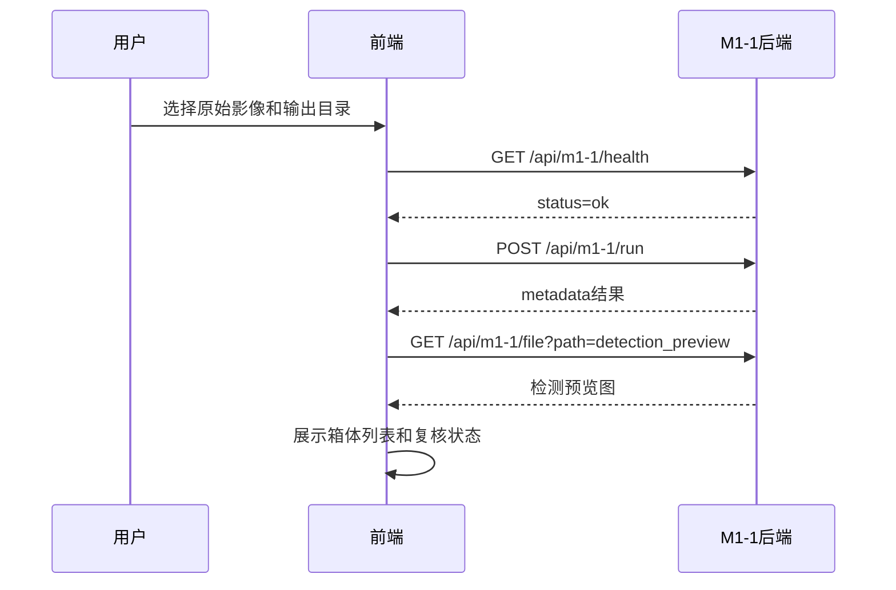
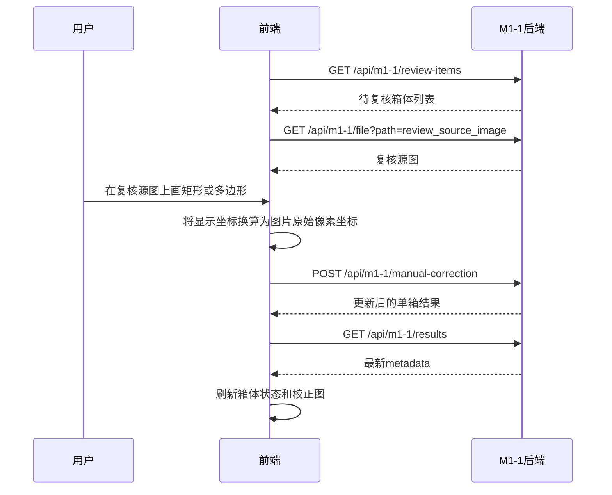

# M1-1 岩心箱旋转校正模块功能与 API 对接说明

本文档面向 Geo-Core AI V2.1 前端开发工程师，说明当前 `M1-1 岩心箱旋转校正` 后端算法模块可以完成什么功能、需要输入什么数据、会输出什么结果、前端应如何调用 API、如何处理需要人工复核的岩心箱，以及人工矩形/多边形框选结果如何回传后端。

当前实现位置：

| 内容 | 路径 |
| --- | --- |
| 算法包 | `geocore_m1_1/` |
| 后端 API 服务 | `geocore_m1_1/server.py` |
| API 适配层 | `geocore_m1_1/api.py` |
| 人工复核同步逻辑 | `geocore_m1_1/review.py` |
| 自动校正主流程 | `geocore_m1_1/pipeline.py` |
| 当前样例输出 | `outputs/m1_1/` |

## 1. 模块定位

M1-1 是岩心智能编录系统的几何预处理模块，位于原始影像导入之后、岩心柱体分割和深度标记之前。

模块解决的问题：

1. 输入一张竖向长条状原始岩心影像。
2. 从长条影像中识别多个独立岩心箱。
3. 将每个岩心箱从履带背景中裁剪出来。
4. 估计岩心箱摆放角度。
5. 使用最近邻采样执行旋转校正，尽量保护原始像元值。
6. 输出规整的单箱影像、掩膜、旋转角、矩阵和质量信息。
7. 对置信度较低的结果标记 `needs_manual_review=true`，供前端触发人工复核。

当前模块不是岩心柱体分割模块，也不会识别岩性、颜色、粒度、矿物等编录属性。它只负责将长条原始图像整理成后续模块可稳定使用的单个岩心箱图像。

## 2. 当前后端能力概览

| 功能 | 当前支持情况 |
| --- | --- |
| ENVI `dat + hdr` 读取 | 支持 |
| 常规 RGB 图片读取 | 支持 PNG/JPG 等 Pillow 可读取格式 |
| 长条影像中多个岩心箱检测 | 支持 |
| 自动旋转校正 | 支持 |
| 最近邻采样旋转 | 支持 |
| 输出单箱影像 | 支持 |
| 输出单箱掩膜 | 支持 |
| 输出 QA 预览图 | 支持 |
| 输出待复核箱体列表 | 支持 |
| 人工矩形框选复核 | 支持 |
| 人工多边形框选复核 | 支持 |
| 人工复核后同步更新 metadata | 支持 |
| 图片文件读取接口 | 支持 |
| 前端页面 | 不在当前模块实现范围内 |

## 3. 服务启动方式

当前后端服务基于 Python 标准库 `http.server` 实现，主要用于算法模块和前端联调。后续如果主系统切换到 FastAPI、Django 或其他服务框架，`geocore_m1_1/api.py` 和 `geocore_m1_1/review.py` 中的核心逻辑可以继续复用。

启动命令：

```powershell
& "C:\Users\Administrator\.cache\codex-runtimes\codex-primary-runtime\dependencies\python\python.exe" -m geocore_m1_1.server `
  --host 127.0.0.1 `
  --port 8765
```

默认服务地址：

```text
http://127.0.0.1:8765
```

服务已开启 CORS：

```http
Access-Control-Allow-Origin: *
Access-Control-Allow-Methods: GET, POST, OPTIONS
Access-Control-Allow-Headers: Content-Type
```

前端本地开发时可直接跨端口调用。

## 4. 输入数据要求

### 4.1 自动校正输入

自动校正 API 需要前端或主系统提供原始影像路径。

对于当前样例 ENVI 数据：

| 字段 | 示例 | 说明 |
| --- | --- | --- |
| `input_path` | `D:/Code/.../RGB-20230909_141858-00000.dat` | 原始数据文件路径 |
| `hdr_path` | `D:/Code/.../RGB-20230909_141858-00000.hdr` | ENVI 头文件路径 |
| `output_dir` | `D:/Code/.../outputs/m1_1` | 输出目录 |
| `expected_box_count` | `9` | 可选，期望检测出的箱体数量 |
| `save_preview` | `true` | 是否输出预览图 |
| `manual_angle_delta_deg` | `0.0` | 可选，整体角度微调值 |

说明：

1. 当前后端接收的是服务器本机可访问的文件路径，不是文件上传流。
2. 如果主系统后续采用上传模式，应先把文件保存到后端可访问路径，再调用 M1-1。
3. `expected_box_count` 可不传。传入后，如果实际检测数量不一致，后端会返回错误，方便前端提示用户检查原始数据。

### 4.2 人工复核输入

人工复核时，前端不需要直接操作原始 `.dat`。后端会给每个岩心箱输出一张 `review_source_image`，前端只需要在这张复核源图上进行矩形或多边形标注，然后把标注坐标回传。

关键约定：

1. 人工框选坐标的坐标系是 `review_source_image` 的像素坐标。
2. 左上角为原点 `(0, 0)`。
3. `x` 向右递增，`y` 向下递增。
4. 后端通过 `review_source_scale_xy` 和 `source_crop_bbox_raw` 将该坐标映射回原始长条影像；大幅面源图会缩采样，前端仍只提交 `review_source_image` 的原始像素坐标，不要自行乘比例。
5. 前端不要把显示缩放后的 CSS 坐标直接传回，必须换算回图片原始像素坐标。

## 5. 输出目录结构

自动运行后，后端会在 `output_dir` 下生成：

```text
outputs/m1_1/
  corrected_boxes/
    box_0001.png
    box_0002.png
    ...
  masks/
    box_0001_mask.png
    box_0002_mask.png
    ...
  review_sources/
    box_0001_source.jpg
    box_0002_source.jpg
    ...
  previews/
    strip_detection_overlay.jpg
    box_0001_before_after.jpg
    ...
  metadata.json
  qa_report.md
```

各目录含义：

| 目录或文件 | 用途 |
| --- | --- |
| `corrected_boxes/` | 校正后的单个岩心箱图像，是后续 M1-2/M1-3 的主要输入 |
| `masks/` | 单箱区域掩膜，标识校正后箱体有效区域 |
| `review_sources/` | 人工复核时前端显示和框选的源图 |
| `previews/` | QA 预览图，用于前端展示算法效果 |
| `metadata.json` | 机器可读的完整结果清单 |
| `qa_report.md` | 人类可读的质量报告 |

## 6. 核心数据结构

### 6.1 批处理结果结构

`POST /api/m1-1/run` 和 `GET /api/m1-1/results` 返回的主体结构如下：

```json
{
  "module": "M1-1",
  "input_path": "D:/.../RGB-20230909_141858-00000.dat",
  "hdr_path": "D:/.../RGB-20230909_141858-00000.hdr",
  "output_dir": "D:/.../outputs/m1_1",
  "box_count": 9,
  "boxes": [],
  "detection_preview": "D:/.../previews/strip_detection_overlay.jpg",
  "qa_report": "D:/.../qa_report.md"
}
```

字段说明：

| 字段 | 类型 | 说明 |
| --- | --- | --- |
| `module` | string | 固定为 `M1-1` |
| `input_path` | string | 原始输入影像路径 |
| `hdr_path` | string/null | ENVI 头文件路径 |
| `output_dir` | string | 输出目录 |
| `box_count` | number | 检测出的岩心箱数量 |
| `boxes` | array | 每个岩心箱的结果 |
| `detection_preview` | string/null | 长条影像检测框预览图 |
| `qa_report` | string/null | QA 报告路径 |

### 6.2 单个岩心箱结果结构

`boxes[]` 中每个对象的结构如下：

```json
{
  "box_id": "box_0006",
  "order_index": 6,
  "bbox_xyxy_raw": [348, 11724, 1763, 14175],
  "bbox_xyxy_corrected": [15, 15, 1489, 2515],
  "angle_deg": 0.5391718638318354,
  "confidence": 0.41119060604926294,
  "needs_manual_review": true,
  "rotation_matrix_2x3": [
    [0.9999557232254225, 0.009410185371301467, 0.6994345703884619],
    [-0.009410185371301467, 0.9999557232254225, 14.51451012610869]
  ],
  "output_image": "D:/.../corrected_boxes/box_0006.png",
  "output_mask": "D:/.../masks/box_0006_mask.png",
  "preview_image": "D:/.../previews/box_0006_before_after.jpg",
  "review_source_image": "D:/.../review_sources/box_0006_source.jpg",
  "source_crop_bbox_raw": [316, 11692, 1795, 14207],
  "correction_status": "auto"
}
```

字段说明：

| 字段 | 类型 | 前端用途 |
| --- | --- | --- |
| `box_id` | string | 箱体唯一 ID，用于后续人工提交 |
| `order_index` | number | 从原始长条影像上到下的序号 |
| `bbox_xyxy_raw` | number[4] | 箱体在原始长条影像中的框，格式 `[x0,y0,x1,y1]` |
| `bbox_xyxy_corrected` | number[4] | 箱体在校正后图像中的有效框 |
| `angle_deg` | number | 自动或人工校正角度，单位度 |
| `confidence` | number | 自动估计置信度，范围大致为 0-1 |
| `needs_manual_review` | boolean | 是否建议人工复核 |
| `rotation_matrix_2x3` | number[2][3] | 旋转矩阵，用于复现几何变换 |
| `output_image` | string | 校正后图像路径 |
| `output_mask` | string | 校正后掩膜路径 |
| `preview_image` | string/null | 校正前后对比图 |
| `review_source_image` | string/null | 人工复核源图，前端应在这张图上画框 |
| `source_crop_bbox_raw` | number[4]/null | 复核源图在原始影像中的位置 |
| `correction_status` | string | `auto` 或 `manual` |

## 7. API 接口说明

### 7.1 健康检查

```http
GET /api/m1-1/health
```

成功响应：

```json
{
  "status": "ok",
  "module": "M1-1"
}
```

前端用途：

1. 页面进入时检查后端服务是否可用。
2. 若不可用，提示用户启动 M1-1 后端服务。

### 7.2 自动执行 M1-1

```http
POST /api/m1-1/run
Content-Type: application/json
```

请求示例：

```json
{
  "input_path": "E:/Code/Geocore_M0&1_Preprocessing/modules/M1-1_rotation_correction/assets/legacy_rgb_20230909/RGB-20230909_141858-00000.dat",
  "hdr_path": "E:/Code/Geocore_M0&1_Preprocessing/modules/M1-1_rotation_correction/assets/legacy_rgb_20230909/RGB-20230909_141858-00000.hdr",
  "output_dir": "E:/Experiment_data/GeoCore_Preprocessing_Runs/M1-1/m1_1",
  "expected_box_count": 9,
  "save_preview": true,
  "manual_angle_delta_deg": 0.0
}
```

请求字段：

| 字段 | 必填 | 类型 | 说明 |
| --- | --- | --- | --- |
| `input_path` | 是 | string | 原始图像路径 |
| `hdr_path` | ENVI 必填 | string/null | ENVI 头文件路径 |
| `output_dir` | 否 | string | 输出目录，默认 `outputs/m1_1` |
| `expected_box_count` | 否 | number/null | 期望箱体数量 |
| `save_preview` | 否 | boolean | 是否保存预览图 |
| `manual_angle_delta_deg` | 否 | number | 全局角度微调 |

成功响应：

返回完整批处理结果，结构同第 6 节。

前端建议：

1. 调用后进入加载状态，因为大图处理可能需要数秒到数十秒。
2. 成功后展示 `detection_preview`，让用户快速检查箱体检测结果。
3. 根据 `boxes[].needs_manual_review` 决定是否展示复核任务。
4. 自动通过的箱体可直接展示 `output_image` 或 `preview_image`。

### 7.3 查询当前结果

```http
GET /api/m1-1/results?output_dir=E:/Experiment_data/GeoCore_Preprocessing_Runs/M1-1/m1_1
```

成功响应：

返回 `metadata.json` 的完整内容。

前端用途：

1. 页面刷新后恢复上一次处理结果。
2. 人工复核提交后重新拉取最新状态。
3. 获取所有输出图像路径、复核状态和角度信息。

### 7.4 查询待复核项

默认只返回 `needs_manual_review=true` 的箱体：

```http
GET /api/m1-1/review-items?output_dir=E:/Experiment_data/GeoCore_Preprocessing_Runs/M1-1/m1_1
```

响应示例：

```json
{
  "output_dir": "E:/Experiment_data/GeoCore_Preprocessing_Runs/M1-1/m1_1",
  "count": 2,
  "items": [
    {
      "box_id": "box_0006",
      "needs_manual_review": true,
      "review_source_image": "D:/.../review_sources/box_0006_source.jpg"
    }
  ]
}
```

如果前端想拿到全部箱体：

```http
GET /api/m1-1/review-items?output_dir=...&only_needs_review=false
```

前端用途：

1. 生成“待复核列表”。
2. 让用户逐个进入人工框选界面。
3. 对比复核前后的 `correction_status`。

### 7.5 读取图片或文件

```http
GET /api/m1-1/file?path=E:/Experiment_data/GeoCore_Preprocessing_Runs/M1-1/m1_1/review_sources/box_0006_source.jpg
```

说明：

1. 该接口按本机文件路径读取文件并返回二进制内容。
2. 前端可以用它加载 `output_image`、`preview_image`、`review_source_image`、`detection_preview` 等文件。
3. URL 中的 `path` 建议使用 `encodeURIComponent` 编码。

前端示例：

```ts
const imageUrl =
  `${baseUrl}/api/m1-1/file?path=${encodeURIComponent(reviewSourceImagePath)}`
```

### 7.6 提交人工矩形校正

```http
POST /api/m1-1/manual-correction
Content-Type: application/json
```

请求示例：

```json
{
  "output_dir": "E:/Experiment_data/GeoCore_Preprocessing_Runs/M1-1/m1_1",
  "input_path": "E:/Code/Geocore_M0&1_Preprocessing/modules/M1-1_rotation_correction/assets/legacy_rgb_20230909/RGB-20230909_141858-00000.dat",
  "hdr_path": "E:/Code/Geocore_M0&1_Preprocessing/modules/M1-1_rotation_correction/assets/legacy_rgb_20230909/RGB-20230909_141858-00000.hdr",
  "box_id": "box_0006",
  "annotation": {
    "type": "rectangle",
    "rect": {
      "x": 40,
      "y": 40,
      "width": 1320,
      "height": 2300
    }
  },
  "manual_angle_delta_deg": 0.0
}
```

请求字段：

| 字段 | 必填 | 类型 | 说明 |
| --- | --- | --- | --- |
| `output_dir` | 是 | string | 当前 M1-1 输出目录 |
| `input_path` | 是 | string | 原始影像路径 |
| `hdr_path` | ENVI 必填 | string/null | 原始 ENVI 头文件路径 |
| `box_id` | 是 | string | 要复核的箱体 ID |
| `annotation` | 是 | object | 人工标注内容 |
| `manual_angle_delta_deg` | 否 | number | 人工额外角度微调 |

矩形坐标说明：

| 字段 | 说明 |
| --- | --- |
| `x` | 矩形左上角 x，基于 `review_source_image` 原始像素 |
| `y` | 矩形左上角 y，基于 `review_source_image` 原始像素 |
| `width` | 矩形宽度，像素 |
| `height` | 矩形高度，像素 |

成功响应：

```json
{
  "status": "success",
  "box": {
    "box_id": "box_0006",
    "needs_manual_review": false,
    "correction_status": "manual",
    "output_image": "D:/.../corrected_boxes/box_0006.png",
    "output_mask": "D:/.../masks/box_0006_mask.png"
  }
}
```

后端行为：

1. 将矩形坐标从 `review_source_image` 映射回原始长条影像。
2. 重新裁剪用户指定的岩心箱区域。
3. 自动估计或使用人工补偿后的角度。
4. 最近邻旋转校正。
5. 覆盖对应 `corrected_boxes/{box_id}.png` 和 `masks/{box_id}_mask.png`。
6. 更新 `metadata.json` 中该箱体字段。
7. 设置 `needs_manual_review=false`。
8. 设置 `correction_status=manual`。

### 7.7 提交人工多边形校正

多边形适合箱体边缘有倾斜或矩形框不够贴合的情况。

```http
POST /api/m1-1/manual-correction
Content-Type: application/json
```

请求示例：

```json
{
  "output_dir": "E:/Experiment_data/GeoCore_Preprocessing_Runs/M1-1/m1_1",
  "input_path": "E:/Code/Geocore_M0&1_Preprocessing/modules/M1-1_rotation_correction/assets/legacy_rgb_20230909/RGB-20230909_141858-00000.dat",
  "hdr_path": "E:/Code/Geocore_M0&1_Preprocessing/modules/M1-1_rotation_correction/assets/legacy_rgb_20230909/RGB-20230909_141858-00000.hdr",
  "box_id": "box_0007",
  "annotation": {
    "type": "polygon",
    "points": [
      {"x": 42, "y": 55},
      {"x": 1370, "y": 38},
      {"x": 1392, "y": 2200},
      {"x": 51, "y": 2220}
    ]
  }
}
```

多边形坐标说明：

1. `points` 至少需要 2 个点，建议 4 个点。
2. 推荐顺序为左上、右上、右下、左下。
3. 坐标仍然基于 `review_source_image` 的原始像素。
4. 当提供 4 个点时，后端会根据左右边点估计人工多边形的倾斜角。
5. 当前后端不会做透视矫正，只会根据多边形外接框裁剪并执行旋转校正。

## 8. 推荐前端交互流程

### 8.1 自动处理流程



前端页面建议展示：

1. 原始长条检测预览图 `detection_preview`。
2. 箱体总数 `box_count`。
3. 每个箱体的 `box_id`、`angle_deg`、`confidence`、`needs_manual_review`。
4. 自动通过的箱体展示 `output_image` 或 `preview_image`。
5. 待复核箱体突出显示。

### 8.2 人工复核流程



前端实现时需要注意：

1. 如果图片在页面中被缩放显示，必须将鼠标坐标还原到图片原始像素坐标。
2. 推荐前端记录图片天然尺寸 `naturalWidth`、`naturalHeight`。
3. 矩形框和多边形点不需要加上 `source_crop_bbox_raw` 偏移，后端会处理。
4. 提交成功后应重新读取 `output_image`，并避免浏览器缓存旧图。
5. 可以在图片 URL 后加时间戳参数，例如 `&t=${Date.now()}`。

## 9. 前端坐标换算示例

如果用户在页面显示图上点击，得到的是 DOM 坐标，需要换算成原始图片像素坐标。

```ts
function toImagePixel(
  clientX: number,
  clientY: number,
  imgElement: HTMLImageElement
) {
  const rect = imgElement.getBoundingClientRect()
  const scaleX = imgElement.naturalWidth / rect.width
  const scaleY = imgElement.naturalHeight / rect.height

  return {
    x: (clientX - rect.left) * scaleX,
    y: (clientY - rect.top) * scaleY,
  }
}
```

矩形框提交前建议规整：

```ts
function normalizeRect(p1: { x: number; y: number }, p2: { x: number; y: number }) {
  const x0 = Math.min(p1.x, p2.x)
  const y0 = Math.min(p1.y, p2.y)
  const x1 = Math.max(p1.x, p2.x)
  const y1 = Math.max(p1.y, p2.y)

  return {
    x: x0,
    y: y0,
    width: x1 - x0,
    height: y1 - y0,
  }
}
```

## 10. 错误响应格式

所有 API 发生错误时，通常返回：

```json
{
  "status": "error",
  "error": "File not found: D:/...",
  "exception_type": "FileNotFoundError"
}
```

常见错误：

| 场景 | HTTP 状态 | 可能原因 | 前端建议 |
| --- | --- | --- | --- |
| 接口路径错误 | 404 | URL 写错 | 检查接口地址 |
| 文件不存在 | 400/404 | 路径不正确或后端不可访问 | 提示用户重新选择文件 |
| JSON 格式错误 | 400 | 请求体不是合法 JSON | 检查请求序列化 |
| 缺少必填字段 | 400 | 缺少 `input_path`、`box_id` 等 | 在表单提交前校验 |
| 箱体 ID 不存在 | 400 | `box_id` 不在 metadata 中 | 刷新结果列表 |
| 箱体数量不符合预期 | 500 或错误 JSON | `expected_box_count` 与检测结果不一致 | 展示检测预览并允许用户调整 |

## 11. 当前样例结果说明

当前样例数据：

```text
RGB-20230909_141858-00000.dat
RGB-20230909_141858-00000.hdr
```

自动检测结果：

| 指标 | 值 |
| --- | --- |
| 检测箱体数量 | 9 |
| 自动通过 | 7 |
| 建议人工复核 | `box_0006`、`box_0007` |

建议人工复核原因：

1. 左右边拟合角度存在分歧。
2. 算法仍输出了校正结果，但置信度低于阈值。
3. 前端应将这两个箱体放入复核队列，让用户确认或重新框选。

## 12. 前端页面功能建议

虽然当前任务只实现后端，但为了便于前端理解，建议页面至少包含以下区域：

1. 数据输入区：
   - 原始影像路径 `input_path`
   - 头文件路径 `hdr_path`
   - 输出目录 `output_dir`
   - 期望箱体数量 `expected_box_count`

2. 自动处理区：
   - 启动 M1-1 按钮
   - 运行状态和错误提示
   - 检测预览图

3. 箱体列表区：
   - `box_id`
   - 自动角度 `angle_deg`
   - 置信度 `confidence`
   - 状态：自动通过、待复核、人工修正

4. 单箱预览区：
   - 校正后图像 `output_image`
   - 校正前后对比图 `preview_image`
   - 掩膜图 `output_mask`

5. 人工复核区：
   - 显示 `review_source_image`
   - 支持矩形框选
   - 支持多边形框选
   - 支持提交人工校正
   - 提交后刷新单箱结果

## 13. 与后续模块的数据衔接

前端或主系统确认 M1-1 完成后，应将以下内容传递给后续 M1-2/M1-3 模块：

1. `corrected_boxes/*.png`：校正后的单箱影像。
2. `masks/*_mask.png`：有效箱体区域掩膜。
3. `metadata.json`：箱体顺序、角度、矩阵和复核状态。

后续模块应优先使用：

```json
{
  "box_id": "box_0001",
  "order_index": 1,
  "output_image": "D:/.../corrected_boxes/box_0001.png",
  "output_mask": "D:/.../masks/box_0001_mask.png",
  "correction_status": "auto"
}
```

如果某个箱体仍然 `needs_manual_review=true`，前端应提示用户先完成复核，再进入后续自动编录流程。

## 14. 对接注意事项

1. 路径字符串建议统一使用 `/` 或在 JSON 中正确转义 `\\`。
2. 图片文件读取应通过 `/api/m1-1/file?path=...`，不要假设前端能直接访问本地磁盘路径。
3. 人工框选坐标必须是图片原始像素坐标，不是 CSS 显示坐标。
4. 人工复核成功后，后端会覆盖同名输出图像，前端要处理缓存刷新。
5. `metadata.json` 是当前模块的状态源，前端状态应以重新拉取的 metadata 为准。
6. 当前后端 API 为同步阻塞调用，处理大图时前端需要显示加载状态。
7. 如后续部署到远程服务器，必须增加文件访问权限控制；当前开发版 `/api/m1-1/file` 可读取后端本机路径。
