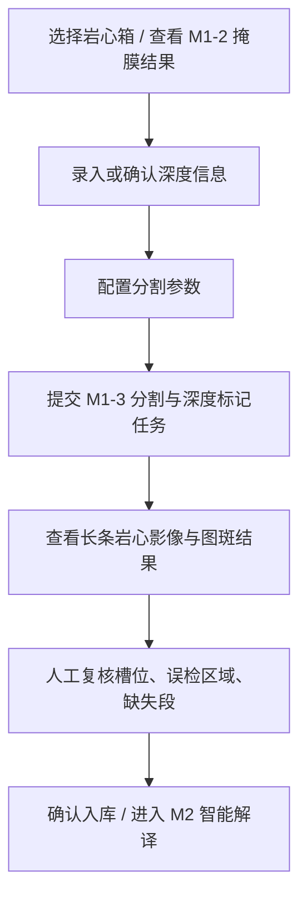

# M1-3 岩心柱体分割与深度标记模块前端对接说明

版本：v0.1  
日期：2026-06-14  
面向对象：前端开发工程师、后端集成工程师、产品交互设计人员  
对应模块：`geocore_m1_3`

## 1. 模块定位

M1-3 是岩心智能编录软件预处理阶段的第三个核心模块，完整名称为 **岩心柱体分割与深度标记算法模块**。

它接收 M1-1 旋转校正后的岩心箱影像，以及 M1-2 生成的岩心前景掩膜结果，完成以下工作：

1. 剔除 M1-2 掩膜中残留的箱外轨道、履带、背景等误识别区域。
2. 自动识别岩心箱内的岩心列，默认按 5 列处理。
3. 将多列岩心按深度顺序重新拼接为一条长条状岩心影像。
4. 根据用户录入的起始深度和终止深度建立像素-深度映射。
5. 按 5-10 cm 或用户指定长度切分为标准图斑。
6. 为每个图斑输出唯一 ID、起止深度、中心深度、图像路径、掩膜路径、质量标记。

前端需要把 M1-3 当成一个“从岩心箱影像生成标准深度图斑库”的后端任务模块，而不是一个普通图片裁剪功能。

## 2. 当前模块已实现能力

当前版本已经实现：

- 读取 M1-2 标准输出目录：
  - `mask.png`
  - `mask.tif`
  - `metadata.json`
  - `contours.json`
  - `probability.tif`
  - `overlay.png`
- 自动从 M1-2 `metadata.json` 中读取原始校正影像路径。
- 支持前端显式传入 `image_path` 覆盖元数据中的路径。
- 自动检测岩心箱槽位，默认 5 列。
- 支持列顺序配置：
  - `left_to_right`
  - `right_to_left`
- 支持列内深度方向配置：
  - `top_to_bottom`
  - `bottom_to_top`
- 支持掩膜误检剔除。
- 支持长条状岩心影像重建。
- 支持固定长度图斑切分。
- 支持重叠切片。
- 支持缺失段 `missing_intervals` 标记。
- 支持深度锚点 `depth_anchors`。
- 输出质量报告和复核清单。
- 提供 CLI 和 FastAPI 接口代码。

当前版本尚未实现完整的前端交互式人工重跑接口，文档中会说明建议预留的交互方式。

## 3. 前端典型工作流

推荐前端将 M1-3 拆成 5 个用户步骤：



### 3.1 选择岩心箱

前端需要让用户选择一个已经完成 M1-1 和 M1-2 的岩心箱任务。

前端至少需要知道：

- 校正后岩心箱影像路径。
- M1-2 输出目录。
- 钻孔号。
- 岩心箱号或回次号。
- 当前岩心箱对应深度范围。

### 3.2 录入深度信息

M1-3 必须知道岩心箱对应的起始深度和终止深度，否则无法生成正式 CoreSegment。

前端表单建议字段：

| 字段 | 必填 | 类型 | 说明 |
| --- | --- | --- | --- |
| `project_id` | 否 | string | 项目 ID |
| `hole_id` | 是 | string | 钻孔号，例如 `DH001` |
| `core_box_id` | 是 | string | 岩心箱唯一 ID，例如 `DH001_BOX_0008` |
| `box_no` | 否 | string | 岩心箱号 |
| `run_no` | 否 | string | 回次号 |
| `depth_start_m` | 是 | number | 起始深度，单位 m |
| `depth_end_m` | 是 | number | 终止深度，单位 m |
| `missing_intervals` | 否 | array | 缺失段列表 |
| `depth_anchors` | 否 | array | 深度锚点列表 |
| `operator` | 否 | string | 操作人 |
| `notes` | 否 | string | 备注 |

前端校验规则：

- `depth_end_m` 必须大于 `depth_start_m`。
- 深度值建议保留 2-3 位小数。
- 同一钻孔内相邻岩心箱深度不应重叠。
- 如果存在缺失岩心，应引导用户录入缺失段。

### 3.3 配置分割参数

建议前端初版只暴露少量业务参数：

| 参数 | 默认值 | 说明 |
| --- | --- | --- |
| `lane_count` | `5` | 岩心箱列数，默认 5 列 |
| `lane_order` | `left_to_right` | 岩心列深度顺序 |
| `lane_direction` | `top_to_bottom` | 单列内部深度方向 |
| `segment_length_cm` | `10.0` | 图斑长度，建议 5-10 cm |
| `overlap_cm` | `0.0` | 图斑重叠长度 |
| `gap_policy` | `close_artificial_gaps` | 空隙处理策略 |

不建议前端初版暴露底层图像参数，例如连通域面积阈值、平滑核大小等。这些参数可以放在高级设置或后端配置文件中。

## 4. API 概览

当前 API 入口文件为：

```text
geocore_m1_3/api/main.py
```

当前已定义接口：

| 方法 | 路径 | 用途 |
| --- | --- | --- |
| `GET` | `/api/system/status` | 查询 M1-3 服务状态 |
| `POST` | `/api/core-boxes/depth-metadata` | 保存岩心箱深度元数据 |
| `GET` | `/api/core-boxes/{core_box_id}/depth-metadata` | 查询岩心箱深度元数据 |
| `POST` | `/api/preprocessing/segment-depth` | 提交 M1-3 分割与深度标记任务 |
| `GET` | `/api/preprocessing/segment-depth/{task_id}` | 查询 M1-3 任务结果 |

注意：当前服务层任务存储和深度元数据存储是内存字典实现，适合开发联调。正式系统中应接入数据库或任务队列。

## 5. 系统状态接口

### 5.1 请求

```http
GET /api/system/status
```

### 5.2 返回示例

```json
{
  "service": "geocore-m1-3",
  "module": "M1-3 core segmentation and depth marking",
  "version": "0.1.0",
  "status": "ok"
}
```

### 5.3 前端用途

前端可用于：

- 判断算法服务是否在线。
- 显示当前模块版本。
- 在任务提交按钮旁展示服务状态。

## 6. 深度元数据保存接口

### 6.1 请求

```http
POST /api/core-boxes/depth-metadata
Content-Type: application/json
```

请求体：

```json
{
  "project_id": "PROJECT_A",
  "hole_id": "DH001",
  "core_box_id": "DH001_BOX_0008",
  "box_no": "0008",
  "run_no": "R08",
  "depth_start_m": 70.0,
  "depth_end_m": 75.0,
  "missing_intervals": [],
  "depth_anchors": [],
  "operator": "frontend_user",
  "notes": "Depth entered from field log."
}
```

### 6.2 字段说明

| 字段 | 类型 | 必填 | 说明 |
| --- | --- | --- | --- |
| `project_id` | string/null | 否 | 项目 ID |
| `hole_id` | string | 是 | 钻孔号 |
| `core_box_id` | string | 是 | 岩心箱唯一 ID |
| `box_no` | string/null | 否 | 岩心箱号 |
| `run_no` | string/null | 否 | 回次号 |
| `depth_start_m` | number | 是 | 起始深度，单位 m |
| `depth_end_m` | number | 是 | 终止深度，单位 m |
| `missing_intervals` | array | 否 | 缺失段 |
| `depth_anchors` | array | 否 | 深度锚点 |
| `operator` | string/null | 否 | 操作人 |
| `notes` | string/null | 否 | 备注 |

### 6.3 返回示例

```json
{
  "core_box_id": "DH001_BOX_0008",
  "status": "saved",
  "project_id": "PROJECT_A",
  "hole_id": "DH001",
  "box_no": "0008",
  "run_no": "R08",
  "depth_start_m": 70.0,
  "depth_end_m": 75.0,
  "missing_intervals": [],
  "depth_anchors": [],
  "operator": "frontend_user",
  "notes": "Depth entered from field log.",
  "updated_at": "2026-06-14T09:00:00+00:00"
}
```

## 7. 深度元数据查询接口

### 7.1 请求

```http
GET /api/core-boxes/DH001_BOX_0008/depth-metadata
```

### 7.2 成功返回

返回字段与保存接口基本一致。

### 7.3 失败返回

如果没有找到该岩心箱的深度元数据：

```json
{
  "detail": "Depth metadata was not found."
}
```

HTTP 状态码：`404`

### 7.4 前端用途

进入 M1-3 页面时，前端应先调用该接口：

- 如果有数据，自动填充深度表单。
- 如果没有数据，提示用户录入起止深度。
- 如果用户只想预览槽位而不生成正式图斑，前端也应明确提示“缺少深度信息，不能进入后续 M2 解译”。

## 8. M1-3 任务提交接口

### 8.1 请求

```http
POST /api/preprocessing/segment-depth
Content-Type: application/json
```

最小请求体：

```json
{
  "core_box_id": "DH001_BOX_0008",
  "image_path": "D:/data/corrected_boxes/box_0008.png",
  "m1_2_output_dir": "D:/data/m1_2_outputs/box_0008",
  "output_dir": "D:/data/m1_3_outputs",
  "hole_id": "DH001",
  "depth_start_m": 70.0,
  "depth_end_m": 75.0
}
```

推荐请求体：

```json
{
  "core_box_id": "DH001_BOX_0008",
  "image_path": "D:/data/corrected_boxes/box_0008.png",
  "m1_2_output_dir": "D:/data/m1_2_outputs/box_0008",
  "output_dir": "D:/data/m1_3_outputs",
  "hole_id": "DH001",
  "depth_start_m": 70.0,
  "depth_end_m": 75.0,
  "layout": {
    "lane_count": 5,
    "lane_order": "left_to_right",
    "lane_direction": "top_to_bottom"
  },
  "segmentation": {
    "segment_length_cm": 10.0,
    "overlap_cm": 0.0
  },
  "mask_refine": {
    "enable": true,
    "outside_lane_remove": true
  },
  "gap_policy": "close_artificial_gaps",
  "missing_intervals": [],
  "depth_anchors": []
}
```

### 8.2 主要字段说明

| 字段 | 类型 | 必填 | 说明 |
| --- | --- | --- | --- |
| `core_box_id` | string | 是 | 岩心箱唯一 ID |
| `image_path` | string/null | 否 | 校正后岩心箱影像路径。如果不传，则尝试从 M1-2 `metadata.json` 的 `input_path` 读取 |
| `m1_2_output_dir` | string | 是 | M1-2 输出目录 |
| `mask_path` | string/null | 否 | 可覆盖默认掩膜路径 |
| `output_dir` | string | 是 | M1-3 输出根目录 |
| `hole_id` | string | 是 | 钻孔号 |
| `depth_start_m` | number | 是 | 起始深度 |
| `depth_end_m` | number | 是 | 终止深度 |
| `layout` | object | 否 | 岩心列布局参数 |
| `segmentation` | object | 否 | 图斑切分参数 |
| `mask_refine` | object | 否 | 掩膜修正参数 |
| `reconstruction` | object | 否 | 长条重建参数 |
| `depth_mapping` | object | 否 | 深度映射参数 |
| `missing_intervals` | array | 否 | 缺失岩心深度段 |
| `depth_anchors` | array | 否 | 深度锚点 |
| `gap_policy` | string/null | 否 | 空隙处理策略 |

### 8.3 布局参数 `layout`

```json
{
  "lane_count": 5,
  "lane_order": "left_to_right",
  "lane_direction": "top_to_bottom"
}
```

字段说明：

| 字段 | 可选值 | 说明 |
| --- | --- | --- |
| `lane_count` | 正整数 | 岩心列数，默认 5 |
| `lane_order` | `left_to_right` / `right_to_left` | 多列之间的深度顺序 |
| `lane_direction` | `top_to_bottom` / `bottom_to_top` | 单列内部深度顺序 |

前端建议：

- 普通岩心箱默认显示 5 列、从左到右、从上到下。
- 提供“方向反转”按钮，便于用户快速修正深度顺序。
- 如果后续出现蛇形摆放，可在高级模式中扩展。

### 8.4 切分参数 `segmentation`

```json
{
  "segment_length_cm": 10.0,
  "overlap_cm": 0.0
}
```

字段说明：

| 字段 | 类型 | 说明 |
| --- | --- | --- |
| `segment_length_cm` | number | 单个图斑代表的岩心长度，建议 5-10 cm |
| `overlap_cm` | number | 相邻图斑重叠长度，必须小于 `segment_length_cm` |

前端建议：

- 默认 `10 cm`。
- 可以提供 `5 cm`、`10 cm` 两个快捷选项。
- 重叠切片建议放到高级设置中，默认关闭。

### 8.5 缺失段 `missing_intervals`

用于标记真实缺失岩心，而不是普通裂隙或摆放空隙。

示例：

```json
[
  {
    "depth_start_m": 72.35,
    "depth_end_m": 72.42,
    "reason": "lost_core",
    "source": "manual"
  }
]
```

字段说明：

| 字段 | 类型 | 说明 |
| --- | --- | --- |
| `depth_start_m` | number | 缺失段起始深度 |
| `depth_end_m` | number | 缺失段终止深度 |
| `reason` | string | 原因，例如 `lost_core` |
| `source` | string | 来源，通常为 `manual` |

前端交互建议：

- 在长条岩心预览上允许用户框选或输入缺失深度段。
- 缺失段应以醒目但不遮挡岩心的方式显示。
- 覆盖缺失段的图斑会输出 `contains_missing_interval` 标记。

### 8.6 深度锚点 `depth_anchors`

用于处理非严格线性深度映射场景。

当前实现要求锚点形式为：

```json
[
  {
    "depth_m": 70.0,
    "strip_y": 0
  },
  {
    "depth_m": 72.5,
    "strip_y": 5120
  },
  {
    "depth_m": 75.0,
    "strip_y": 10240
  }
]
```

字段说明：

| 字段 | 类型 | 说明 |
| --- | --- | --- |
| `depth_m` | number | 锚点深度 |
| `strip_y` | number | 长条岩心影像中的纵向像素坐标 |

前端交互建议：

- 初版可以不暴露该功能。
- 高级模式中，可允许用户在长条图像上点击某个位置并输入实际深度。
- 后端会在相邻锚点之间做分段线性插值。

## 9. M1-3 任务返回结构

### 9.1 成功返回示例

```json
{
  "task_id": "m1_3_20260614_171200_123456",
  "status": "succeeded",
  "output_dir": "D:/data/m1_3_outputs/m1_3_20260614_171200_123456",
  "output_files": {
    "refined_mask": "D:/data/m1_3_outputs/m1_3_20260614_171200_123456/refined_mask.png",
    "lane_detection": "D:/data/m1_3_outputs/m1_3_20260614_171200_123456/lane_detection.json",
    "reconstructed_strip": "D:/data/m1_3_outputs/m1_3_20260614_171200_123456/reconstructed_strip.png",
    "segments_json": "D:/data/m1_3_outputs/m1_3_20260614_171200_123456/segments.json",
    "quality_report": "D:/data/m1_3_outputs/m1_3_20260614_171200_123456/quality_report.json"
  },
  "metrics": {
    "lane_count_detected": 5,
    "segment_count": 50,
    "removed_component_count": 2,
    "strip_height_px": 10269,
    "meters_per_pixel": 0.0004869023273931249
  },
  "warnings": []
}
```

### 9.2 字段说明

| 字段 | 说明 |
| --- | --- |
| `task_id` | 任务 ID |
| `status` | 当前任务状态，成功为 `succeeded` |
| `output_dir` | 本次任务输出目录 |
| `output_files.refined_mask` | 修正后的岩心前景掩膜 |
| `output_files.lane_detection` | 岩心列检测结果 |
| `output_files.reconstructed_strip` | 重建后的长条岩心影像 |
| `output_files.segments_json` | 图斑列表与深度信息 |
| `output_files.quality_report` | 质量报告 |
| `metrics.lane_count_detected` | 检测到的岩心列数 |
| `metrics.segment_count` | 生成图斑数量 |
| `metrics.removed_component_count` | 被剔除的误检连通域数量 |
| `metrics.strip_height_px` | 长条影像高度 |
| `metrics.meters_per_pixel` | 深度映射比例 |
| `warnings` | 需要前端提示用户复核的问题 |

### 9.3 失败返回示例

如果参数错误或文件不存在，接口返回 `400`：

```json
{
  "detail": "Input image does not exist: D:/data/corrected_boxes/box_0008.png"
}
```

前端应将 `detail` 作为错误信息展示给用户。

## 10. 任务查询接口

### 10.1 请求

```http
GET /api/preprocessing/segment-depth/{task_id}
```

### 10.2 当前实现说明

当前版本的 `POST /api/preprocessing/segment-depth` 是同步执行：任务完成后直接返回完整结果。`GET` 查询接口可以查询当前进程内保存的任务结果。

正式产品建议后续改造成异步任务：

1. `POST` 立即返回 `pending`。
2. 前端轮询 `GET`。
3. 后端逐步返回 `progress`。
4. 成功后返回完整输出路径。

前端可以先按异步模式设计 UI，以便后续平滑升级。

## 11. 输出目录结构

一次成功任务会生成如下目录：

```text
outputs/{task_id}/
  input_manifest.json
  refined_mask.png
  refined_mask.tif
  refined_overlay.png
  removed_components.json
  mask_refine_report.json
  lane_detection.json
  lane_debug_overlay.png
  lane_strips/
    lane_01.png
    lane_01_mask.png
    lane_02.png
    lane_02_mask.png
  reconstructed_strip.png
  reconstructed_strip_mask.png
  reconstructed_strip_preview.jpg
  strip_mapping.json
  depth_mapping.json
  segments/
    DH001_0070.00_0070.10.png
    DH001_0070.00_0070.10_mask.png
  segments.json
  quality_report.json
  review_manifest.json
```

前端最常用文件：

| 文件 | 前端用途 |
| --- | --- |
| `refined_overlay.png` | 查看掩膜修正效果 |
| `lane_debug_overlay.png` | 查看自动识别的岩心列 |
| `reconstructed_strip_preview.jpg` | 快速预览长条岩心 |
| `reconstructed_strip.png` | 高质量长条岩心图，带 alpha |
| `segments.json` | 图斑列表、深度和路径 |
| `quality_report.json` | 质量指标与 warning |
| `review_manifest.json` | 是否需要人工复核 |

## 12. `segments.json` 说明

### 12.1 文件结构

```json
{
  "task_id": "smoke_box_0008",
  "module": "M1-3 core segmentation and depth marking",
  "module_version": "0.1.0",
  "core_box_id": "BOX_0008",
  "hole_id": "DH_SMOKE",
  "depth_start_m": 0.0,
  "depth_end_m": 5.0,
  "segment_length_cm": 10.0,
  "overlap_cm": 0.0,
  "segment_count": 50,
  "segments": []
}
```

### 12.2 单个图斑字段

```json
{
  "segment_id": "DH_SMOKE_0000.00_0000.10",
  "core_box_id": "BOX_0008",
  "hole_id": "DH_SMOKE",
  "depth_start_m": 0.0,
  "depth_end_m": 0.1,
  "depth_center_m": 0.05,
  "length_cm": 10.0,
  "image_path": "D:/.../segments/DH_SMOKE_0000.00_0000.10.png",
  "mask_path": "D:/.../segments/DH_SMOKE_0000.00_0000.10_mask.png",
  "source_strip_bbox": [0, 0, 233, 206],
  "core_coverage_ratio": 0.7243,
  "missing_ratio": 0.0,
  "quality_flags": []
}
```

字段说明：

| 字段 | 说明 |
| --- | --- |
| `segment_id` | 图斑唯一 ID |
| `core_box_id` | 来源岩心箱 ID |
| `hole_id` | 钻孔号 |
| `depth_start_m` | 图斑起始深度 |
| `depth_end_m` | 图斑终止深度 |
| `depth_center_m` | 图斑中心深度 |
| `length_cm` | 图斑代表的实际长度 |
| `image_path` | 图斑图片路径 |
| `mask_path` | 图斑掩膜路径 |
| `source_strip_bbox` | 图斑在长条图中的像素范围 |
| `core_coverage_ratio` | 图斑内岩心前景占比 |
| `missing_ratio` | 图斑覆盖缺失段比例 |
| `quality_flags` | 质量标记 |

### 12.3 前端展示建议

建议前端以图斑表格或图斑列表展示：

| 展示项 | 来源字段 |
| --- | --- |
| 缩略图 | `image_path` |
| 深度范围 | `depth_start_m` - `depth_end_m` |
| 中心深度 | `depth_center_m` |
| 岩心覆盖率 | `core_coverage_ratio` |
| 缺失比例 | `missing_ratio` |
| 质量状态 | `quality_flags` |

当 `quality_flags` 不为空时，应在图斑上显示复核标识。

## 13. `quality_report.json` 说明

示例：

```json
{
  "lane_count_expected": 5,
  "lane_count_detected": 5,
  "removed_component_count": 2,
  "removed_area_ratio": 0.020453882768621815,
  "strip_pixel_length": 10269,
  "strip_pixel_width": 233,
  "depth_span_m": 5.0,
  "meters_per_pixel": 0.0004869023273931249,
  "segment_count": 50,
  "low_coverage_segment_count": 0,
  "segments_with_missing_interval_count": 0,
  "missing_interval_count": 0,
  "warnings": []
}
```

字段说明：

| 字段 | 说明 |
| --- | --- |
| `lane_count_expected` | 期望岩心列数 |
| `lane_count_detected` | 实际检测岩心列数 |
| `removed_component_count` | 被剔除的误检区域数量 |
| `removed_area_ratio` | 被剔除面积占原前景面积比例 |
| `strip_pixel_length` | 长条岩心影像高度 |
| `strip_pixel_width` | 长条岩心影像宽度 |
| `depth_span_m` | 深度跨度 |
| `meters_per_pixel` | 像素到深度比例 |
| `segment_count` | 图斑数量 |
| `low_coverage_segment_count` | 低岩心覆盖率图斑数量 |
| `segments_with_missing_interval_count` | 覆盖缺失段的图斑数量 |
| `missing_interval_count` | 缺失段数量 |
| `warnings` | 复核提醒 |

前端建议：

- 在任务结果页顶部展示核心指标。
- 如果 `warnings` 非空，显示“需要人工复核”状态。
- 如果 `lane_count_detected != lane_count_expected`，应提示用户检查列数或方向参数。
- 如果 `removed_area_ratio` 过高，应提示用户检查 M1-2 掩膜质量。

## 14. `review_manifest.json` 说明

示例：

```json
{
  "task_id": "smoke_box_0008",
  "needs_review": false,
  "warnings": [],
  "review_targets": {
    "lane_debug_overlay": "D:/.../lane_debug_overlay.png",
    "refined_overlay": "D:/.../refined_overlay.png",
    "reconstructed_strip_preview": "D:/.../reconstructed_strip_preview.jpg"
  }
}
```

前端用途：

- 如果 `needs_review = true`，结果页默认进入复核状态。
- `lane_debug_overlay` 用于检查列框是否正确。
- `refined_overlay` 用于检查误检剔除是否过度或不足。
- `reconstructed_strip_preview` 用于检查长条拼接顺序是否正确。

## 15. 前端交互设计建议

### 15.1 M1-3 参数面板

建议包含：

- 钻孔号。
- 岩心箱号。
- 起始深度。
- 终止深度。
- 分割长度。
- 重叠长度。
- 岩心列数。
- 列顺序。
- 列内方向。
- 是否启用掩膜修正。

推荐默认值：

```json
{
  "lane_count": 5,
  "lane_order": "left_to_right",
  "lane_direction": "top_to_bottom",
  "segment_length_cm": 10.0,
  "overlap_cm": 0.0,
  "gap_policy": "close_artificial_gaps"
}
```

### 15.2 任务结果页

建议包含 4 个视图：

1. **掩膜修正视图**
   - 显示 `refined_overlay.png`。
   - 显示剔除区域数量和面积比例。

2. **槽位检测视图**
   - 显示 `lane_debug_overlay.png`。
   - 用户检查 5 列边界是否正确。

3. **长条岩心视图**
   - 显示 `reconstructed_strip_preview.jpg`。
   - 支持滚动查看。
   - 建议左侧显示深度刻度。

4. **图斑列表视图**
   - 读取 `segments.json`。
   - 展示图斑缩略图、深度、质量标记。
   - 支持点击图斑进入后续 M2 解译。

### 15.3 人工复核操作

当前后端已输出复核所需文件，但完整人工修正重跑接口尚未最终固化。前端可以先预留以下交互：

- 修改列顺序：
  - 从左到右。
  - 从右到左。
- 修改列内方向：
  - 从上到下。
  - 从下到上。
- 修改切分长度。
- 修改起止深度。
- 添加缺失段。
- 添加深度锚点。
- 重新提交 M1-3 任务。

初版可通过重新调用 `POST /api/preprocessing/segment-depth` 完成重跑。

### 15.4 长条岩心深度刻度

前端可使用 `depth_mapping.json` 绘制深度刻度。

核心字段：

```json
{
  "depth_start_m": 0.0,
  "depth_end_m": 5.0,
  "strip_height_px": 10269,
  "meters_per_pixel": 0.0004869023273931249
}
```

换算公式：

```text
depth_m = depth_start_m + y / strip_height_px * (depth_end_m - depth_start_m)
```

如果存在多个锚点，应根据 `anchors` 做分段线性插值。

## 16. 文件路径处理约定

当前接口返回的是后端本机文件路径，例如：

```text
D:/data/m1_3_outputs/task_id/reconstructed_strip.png
```

正式前后端分离部署时，建议后端提供静态文件访问或文件下载接口，将本地路径转换为 URL：

```json
{
  "reconstructed_strip_url": "/static/m1_3_outputs/task_id/reconstructed_strip.png"
}
```

前端不要长期依赖本机绝对路径作为浏览器可访问地址。当前路径更适合作为后端任务产物索引和数据库记录。

## 17. 状态与错误处理建议

当前 `status` 可能值：

| 状态 | 说明 |
| --- | --- |
| `succeeded` | 任务成功完成 |
| `failed` | 任务失败 |

后续异步化后建议扩展：

| 状态 | 说明 |
| --- | --- |
| `pending` | 等待执行 |
| `running` | 执行中 |
| `succeeded` | 成功 |
| `failed` | 失败 |
| `waiting_for_depth_metadata` | 等待用户补录深度 |
| `needs_review` | 需要人工复核 |

常见错误：

| 错误场景 | 前端提示建议 |
| --- | --- |
| 输入影像不存在 | 请检查 M1-1 校正影像路径 |
| M1-2 掩膜不存在 | 请先完成 M1-2 前景掩膜 |
| 影像和掩膜尺寸不一致 | 请重新生成 M1-2 掩膜或检查输入文件 |
| 起止深度错误 | 终止深度必须大于起始深度 |
| 重叠长度大于切片长度 | 重叠长度必须小于图斑长度 |

## 18. 与后续 M2/M3 的数据关系

M1-3 输出的 `segments.json` 是后续模块的核心输入。

M2 属性识别建议使用：

- `segment_id`
- `image_path`
- `mask_path`
- `depth_start_m`
- `depth_end_m`
- `depth_center_m`

M3 自动分层建议使用：

- 按 `depth_center_m` 排序的图斑序列。
- M2 输出的颜色、粒度、岩性、矿物等属性。
- M1-3 记录的缺失段和质量标记。

前端在进入 M2/M3 前应确认：

- `segment_count > 0`。
- `quality_report.warnings` 已处理或用户确认忽略。
- 关键图斑不存在大量 `low_core_coverage`。

## 19. CLI 联调方式

如果暂时不启动 API，前端或后端联调人员可以用 CLI 生成样例输出。

```powershell
python -m geocore_m1_3.cli segment-depth `
  --m1-2-output-dir "E:\Code\Geocore_M0&1_Preprocessing\modules\M1-2_foreground_mask\qa\legacy_outputs_20260714\core_mask_v2_corrected_boxes\box_0008" `
  --output-dir "E:\Experiment_data\GeoCore_Preprocessing_Runs\M1-3" `
  --hole-id DH001 `
  --core-box-id BOX_0008 `
  --depth-start-m 0 `
  --depth-end-m 5 `
  --segment-length-cm 10
```

真实 smoke test 已验证：

```json
{
  "lane_count_detected": 5,
  "segment_count": 50,
  "removed_component_count": 2,
  "strip_height_px": 10269,
  "meters_per_pixel": 0.0004869023273931249
}
```

## 20. 前端开发检查清单

前端接入 M1-3 时，建议逐项确认：

- 能选择已经完成 M1-2 的岩心箱。
- 能录入并保存 `depth_start_m`、`depth_end_m`。
- 能配置分割长度和列方向。
- 能提交 `/api/preprocessing/segment-depth`。
- 能展示任务成功后的核心指标。
- 能加载 `refined_overlay.png`。
- 能加载 `lane_debug_overlay.png`。
- 能滚动显示 `reconstructed_strip_preview.jpg`。
- 能读取 `segments.json` 并显示图斑列表。
- 能根据 `quality_flags` 和 `warnings` 提醒复核。
- 能重新提交任务以修正方向、深度或缺失段。

## 21. 当前版本限制

当前版本需要前端注意：

- API 服务需要部署环境安装 `fastapi` 和 `uvicorn`。
- 任务执行目前是同步执行，正式产品建议改成异步任务。
- 深度元数据当前内存保存，正式产品应接数据库。
- 当前人工修正以“修改参数后重新提交任务”为主。
- 当前列检测适合旋转校正后的竖向岩心箱影像。
- 如果岩心箱不是 5 列，前端必须传入正确的 `lane_count`。
- 浏览器不能直接访问后端本地绝对路径，正式部署需提供静态文件 URL 或下载接口。

## 22. 推荐下一步接口扩展

为了提升前端交互体验，后续建议增加：

| 接口 | 用途 |
| --- | --- |
| `GET /api/preprocessing/segment-depth/{task_id}/segments` | 分页返回图斑列表 |
| `GET /api/files?path=...` | 将后端文件路径转为可下载响应 |
| `PUT /api/preprocessing/segment-depth/{task_id}/corrections` | 保存人工修正 |
| `POST /api/preprocessing/segment-depth/{task_id}/rerun` | 基于修正结果重跑 |
| `GET /api/preprocessing/segment-depth/{task_id}/preview` | 返回前端预览所需的 URL 集合 |

这些接口不是当前最小可用版本必需项，但建议前端在页面结构上预留入口。

## 23. 总结

前端接入 M1-3 时，最重要的是把它理解为“深度图斑标准化生产模块”。它的输入是校正影像、M1-2 掩膜和深度信息；它的输出是长条岩心影像、固定长度图斑、深度映射和质量报告。

前端页面应围绕三个核心动作组织：

1. **确认深度和排列规则。**
2. **提交任务并展示长条重建结果。**
3. **复核图斑质量并将 CoreSegment 交给后续智能解译模块。**

只要这三个动作闭环打通，M1-3 就可以稳定支撑后续颜色、粒度、岩性、矿物识别以及自动地质分层流程。
