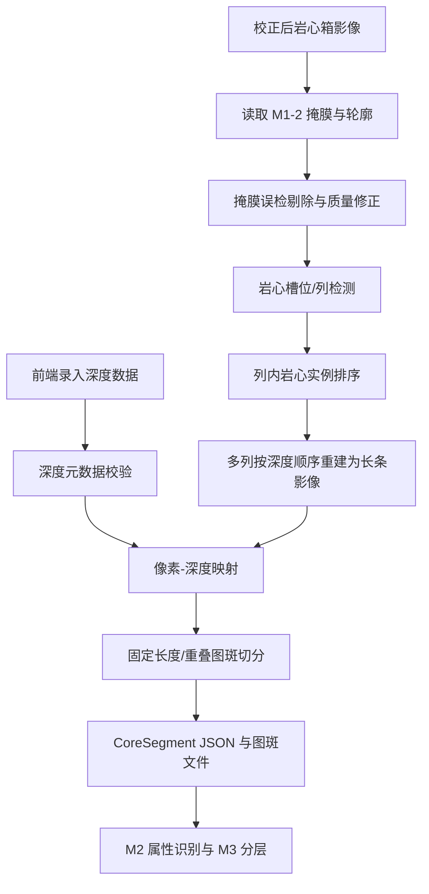

# M1-3 岩心柱体分割与深度标记算法模块实现方案

版本：v0.1  
日期：2026-06-14  
适用仓库：`E:/Code/Geocore_M0&1_Preprocessing/modules/M1-3_separator_mark`

## 1. 文档目标

本文档用于设计 **M1-3 岩心柱体分割与深度标记算法模块** 的实现方案。该模块承接 M1-1 岩心箱旋转校正和 M1-2 岩心柱体前景掩膜结果，将岩心箱内多列并排摆放的岩心柱，按钻孔深度关系重建为一条连续的长条状钻孔岩心影像，并按固定深度长度切分为标准图斑，供后续 M2 智能解译和 M3 地质分层使用。

本方案重点解决以下问题：

- 从 M1-2 掩膜结果中剔除箱外轨道、背景、标签纸等误识别前景。
- 自动识别岩心箱内 5 列或可配置列数的岩心槽位。
- 将每列岩心按深度顺序首尾拼接，形成单条长条状岩心影像。
- 建立像素坐标、物理长度和钻孔深度之间的映射关系。
- 按 5-10 cm 或用户指定长度切分为标准 CoreSegment 图斑。
- 为每个图斑输出唯一 ID、起止深度、中心深度、空间范围、质量信息和可追溯元数据。
- 设计后端 API，支持前端录入深度数据、提交分割任务、查看结果和人工修正。

## 2. 上下游定位

### 2.1 上游输入

M1-3 的直接上游为：

1. **M1-1 岩心箱旋转校正**
   - 输出校正后的岩心箱影像。
   - 岩心长轴应基本与图像竖直方向一致。
   - 建议保留旋转矩阵和原图到校正图的坐标变换。

2. **M1-2 岩心柱体前景掩膜**
   - 当前样例输出目录已包含：
     - `mask.png`
     - `mask.tif`
     - `probability.tif`
     - `overlay.png`
     - `contours.json`
     - `metadata.json`
   - M1-3 应优先复用这些结构化输出，避免重新定义一套输入格式。

3. **前端或数据库录入的深度信息**
   - 钻孔号。
   - 岩心箱号或回次号。
   - 起始深度。
   - 终止深度。
   - 可选的回次进尺、采取率、缺失段、人工深度锚点。

### 2.2 下游输出

M1-3 的输出面向：

- M2-1 颜色识别。
- M2-2 粒度识别。
- M2-5 岩性识别。
- M2-6 矿物识别。
- M3-1 自动地质分层。
- 数据库中的 `CoreSegments` 主表。

因此 M1-3 输出不能只是一批图片，还必须是一批有深度、有空间范围、有质量记录的结构化数据单元。

## 3. 模块核心定义

### 3.1 CoreBox

表示一张岩心箱影像及其深度范围。

关键字段：

```json
{
  "core_box_id": "DH001_BOX_0008",
  "project_id": "PROJECT_A",
  "hole_id": "DH001",
  "box_no": "0008",
  "run_no": "R08",
  "depth_start_m": 70.0,
  "depth_end_m": 75.0,
  "image_path": "D:/data/corrected_boxes/box_0008.png",
  "m1_2_output_dir": "D:/data/m1_2_outputs/box_0008",
  "layout_profile": "five_lanes_left_to_right_top_down"
}
```

### 3.2 CoreRun 或 CoreLane

表示岩心箱中的一列岩心槽位。当前样例多为 5 个竖条并列排列，因此默认按 5 列处理，但算法必须允许配置列数。

关键字段：

```json
{
  "lane_id": "DH001_BOX_0008_L03",
  "lane_index": 3,
  "order_index": 3,
  "bbox": [640, 40, 820, 2060],
  "centerline": [[732, 40], [728, 2060]],
  "direction": "top_to_bottom",
  "valid_pixel_length": 2018
}
```

### 3.3 ReconstructedCoreStrip

表示从多列岩心重组得到的长条状岩心影像。

关键字段：

```json
{
  "strip_id": "DH001_BOX_0008_STRIP",
  "depth_start_m": 70.0,
  "depth_end_m": 75.0,
  "strip_image": "outputs/{task_id}/reconstructed_strip.png",
  "strip_mask": "outputs/{task_id}/reconstructed_strip_mask.png",
  "pixel_length": 10240,
  "meters_per_pixel": 0.00048828125,
  "lane_order": [1, 2, 3, 4, 5]
}
```

### 3.4 CoreSegment

表示切分后的标准图斑，是后续智能解译的最小数据单元。

关键字段：

```json
{
  "segment_id": "DH001_070.00_070.10",
  "core_box_id": "DH001_BOX_0008",
  "hole_id": "DH001",
  "depth_start_m": 70.0,
  "depth_end_m": 70.1,
  "depth_center_m": 70.05,
  "length_cm": 10.0,
  "image_path": "outputs/{task_id}/segments/DH001_070.00_070.10.png",
  "mask_path": "outputs/{task_id}/segments/DH001_070.00_070.10_mask.png",
  "source_strip_bbox": [0, 0, 256, 205],
  "core_coverage_ratio": 0.92,
  "missing_ratio": 0.0,
  "quality_flags": []
}
```

## 4. 整体技术路线



核心原则：

- **先保证深度顺序正确，再追求视觉拼接美观。**
- **小裂隙和断面不等于缺失段，不能简单删除。**
- **箱外误检和槽外误检必须尽量自动剔除，并保留剔除记录。**
- **所有自动判断都要允许人工复核和修正。**
- **深度映射必须可追溯，不能只在图片文件名里隐含深度。**

## 5. 输入数据规范

### 5.1 必需输入

```json
{
  "image_path": "D:/data/corrected_boxes/box_0008.png",
  "mask_path": "D:/data/m1_2_outputs/box_0008/mask.png",
  "metadata_path": "D:/data/m1_2_outputs/box_0008/metadata.json",
  "contours_path": "D:/data/m1_2_outputs/box_0008/contours.json",
  "hole_id": "DH001",
  "core_box_id": "DH001_BOX_0008",
  "depth_start_m": 70.0,
  "depth_end_m": 75.0
}
```

### 5.2 可选输入

```json
{
  "probability_path": "D:/data/m1_2_outputs/box_0008/probability.tif",
  "box_no": "0008",
  "run_no": "R08",
  "lane_count": 5,
  "lane_order": "left_to_right",
  "lane_direction": "top_to_bottom",
  "segment_length_cm": 10,
  "overlap_cm": 0,
  "gap_policy": "close_artificial_gaps",
  "missing_intervals": [
    {
      "depth_start_m": 72.35,
      "depth_end_m": 72.42,
      "reason": "lost_core"
    }
  ],
  "depth_anchors": [
    {
      "depth_m": 70.0,
      "lane_index": 1,
      "position": "lane_start"
    },
    {
      "depth_m": 75.0,
      "lane_index": 5,
      "position": "lane_end"
    }
  ],
  "manual_lane_polygons": [],
  "manual_remove_regions": [],
  "manual_keep_regions": []
}
```

## 6. 算法流程设计

### 6.1 阶段 A：输入加载与一致性检查

目标：确保图像、掩膜、轮廓、深度数据能够进入同一坐标系。

检查项：

- 原图尺寸、掩膜尺寸、概率图尺寸必须一致。
- `metadata.json` 中的 `image_width`、`image_height` 应与实际图像一致。
- `depth_end_m` 必须大于 `depth_start_m`。
- `depth_end_m - depth_start_m` 应与岩心箱常规长度、回次长度或用户录入信息相容。
- 若 M1-1 输出了旋转矩阵，保留在 M1-3 的 `lineage` 元数据中。

异常策略：

- 尺寸不一致：任务失败，要求重新生成掩膜或提供正确文件。
- 深度缺失：任务进入 `waiting_for_depth_metadata` 状态，前端提示用户补录。
- 深度范围异常：任务可继续预览槽位，但不生成正式 CoreSegment。

### 6.2 阶段 B：M1-2 掩膜误检剔除与修正

当前样例中存在岩心箱外部轨道、履带或背景局部被误识别为岩心的问题。M1-3 应在重建前增加一个掩膜修正环节。

#### 6.2.1 基于连通域的初筛

从 `mask.png` 或 `mask.tif` 读取二值掩膜，计算连通域：

- 面积 `area`。
- 外接框 `bbox`。
- 质心 `centroid`。
- 长宽比 `aspect_ratio`。
- 与图像边缘的接触情况。
- 与候选岩心槽位的空间关系。

初步剔除规则：

- 面积小于 `min_component_area_px` 且远离任何槽位中心线。
- 质心位于候选岩心箱主体区域外。
- 外接框贴近图像边缘且形态不符合岩心块。
- 与主槽位区域没有空间邻近关系。

注意：破碎岩心可能形成小连通域，不能只按面积删除。小连通域如果位于槽位内部，并且邻近主岩心区域，应保留。

#### 6.2.2 基于槽位模型的误检剔除

在检测出 5 个或用户指定数量的槽位后，对每个前景连通域判断其是否落入有效槽位区域：

- 落在槽位内部：默认保留。
- 横跨槽位和隔板：按槽位边界裁切。
- 落在槽位外但接近边缘：标记为 `low_confidence_foreground`。
- 明显位于箱外：剔除，并写入 `removed_components.json`。

#### 6.2.3 基于概率图的边界修正

如果存在 `probability.tif`，可用概率图辅助修正：

- 对低置信度边缘进行收缩。
- 对岩心内部小空洞进行有限填补。
- 对槽位外低概率区域直接抑制。

建议参数：

```yaml
mask_refine:
  min_component_area_px: 200
  outside_lane_remove: true
  fill_hole_area_px: 800
  smooth_kernel_size: 5
  low_confidence_threshold: 0.35
  high_confidence_threshold: 0.65
```

输出：

- `refined_mask.png`
- `refined_mask.tif`
- `removed_components.json`
- `mask_refine_report.json`
- `refined_overlay.png`

### 6.3 阶段 C：岩心槽位检测

目标：识别岩心箱内每个竖向槽位，为后续列内排序和重建提供几何框架。

默认输入是经过 M1-1 校正后的图像和 M1-2/M1-3 修正后的掩膜。

#### 6.3.1 默认方法：X 方向投影

流程：

1. 对修正掩膜沿 Y 方向求和，得到 X 方向前景投影曲线。
2. 平滑投影曲线，弱化裂隙和局部断芯影响。
3. 寻找前景峰值区间和隔板谷值区间。
4. 根据 `lane_count` 约束拟合 5 个槽位区间。
5. 为每个槽位生成 `bbox`、中心线和宽度。

适用场景：

- 岩心箱已经校正。
- 岩心列大致竖直。
- 每列岩心槽之间有明显间隔。

#### 6.3.2 备用方法：连通域聚类

当投影曲线不稳定时，可使用连通域质心的 X 坐标聚类：

- 使用 KMeans 或一维动态规划聚类。
- 聚类数量默认等于 `lane_count`。
- 使用连通域面积作为权重。
- 聚类后生成每列槽位中心线。

#### 6.3.3 备用方法：人工槽位多边形

如果自动检测失败，前端允许用户绘制或调整槽位边界：

```json
{
  "manual_lane_polygons": [
    {
      "lane_index": 1,
      "polygon": [[230, 40], [410, 40], [405, 2050], [220, 2050]]
    }
  ]
}
```

算法记录 `lane_detection_mode = manual`，并继续完成后续重建和切分。

### 6.4 阶段 D：列内岩心排序与有效长度估计

每个槽位内部，岩心按图像 Y 坐标从上到下排列。默认深度方向为：

```text
第 1 列顶部 -> 第 1 列底部 -> 第 2 列顶部 -> 第 2 列底部 -> ... -> 第 5 列底部
```

但不同岩心箱可能存在其他摆放规则，因此必须支持配置：

```yaml
layout:
  lane_count: 5
  lane_order: left_to_right
  lane_direction: top_to_bottom
  allow_snake_order: false
```

可选模式：

- `left_to_right`：从左到右。
- `right_to_left`：从右到左。
- `snake_left_to_right`：奇数列上到下，偶数列下到上。
- `manual`：完全由前端传入列顺序。

有效长度估计：

- 对每列取槽位内前景的上下边界。
- 对明显人工摆放间隔进行压缩或保留，取决于 `gap_policy`。
- 小裂隙和岩心断面不计为缺失段。
- 明确缺失段由用户标注或根据异常大空白间隔提示人工确认。

### 6.5 阶段 E：长条状岩心影像重建

目标：完全剔除岩心箱和背景，只保留岩心主体，将多列岩心按深度顺序拼接为一条连续影像。

#### 6.5.1 单列标准化

对每一列：

1. 使用槽位区域和修正掩膜裁剪原图。
2. 以掩膜中心线或槽位中心线对齐岩心。
3. 将列宽标准化为统一宽度，例如取所有列有效宽度的中位数并加少量边距。
4. 背景置透明或统一黑色，推荐内部计算使用透明 alpha，预览图可使用黑色背景。
5. 输出每列的 `lane_strip_{index}.png` 和 `lane_strip_{index}_mask.png`。

#### 6.5.2 多列拼接

将标准化后的列影像按深度顺序纵向拼接：

```text
lane_1_strip
+ lane_2_strip
+ lane_3_strip
+ lane_4_strip
+ lane_5_strip
= reconstructed_strip
```

输出：

- `reconstructed_strip.png`
- `reconstructed_strip_mask.png`
- `reconstructed_strip_preview.jpg`
- `strip_mapping.json`

#### 6.5.3 间隔处理策略

`gap_policy` 决定如何处理列内和列间空白：

- `close_artificial_gaps`：默认策略。压缩由岩心箱隔板、摆放空隙造成的空白，使岩心更接近连续柱状形态。
- `preserve_all_gaps`：保留所有空白，适合需要严格复原拍摄状态的检查模式。
- `preserve_missing_intervals`：压缩普通摆放空隙，但保留人工标注的缺失段。

推荐默认使用 `close_artificial_gaps`，并要求缺失段通过前端或数据库显式标注。

### 6.6 阶段 F：像素与深度映射

深度映射是 M1-3 的核心。默认使用起止深度做线性映射：

```text
depth_m = depth_start_m + strip_y / strip_effective_height_px * (depth_end_m - depth_start_m)
```

其中：

- `strip_y` 为长条影像中的纵向像素坐标。
- `strip_effective_height_px` 为用于深度映射的有效高度。
- `depth_start_m` 和 `depth_end_m` 由前端录入或数据库提供。

#### 6.6.1 基础线性映射

适用场景：

- 岩心箱中岩心采取完整。
- 无明显缺失段。
- 每列表示的实物深度长度基本一致。

优点是稳定、简单、可解释。

#### 6.6.2 带深度锚点的分段线性映射

对于长孔段、缺失段或人工校正场景，应支持深度锚点：

```json
{
  "depth_anchors": [
    {"depth_m": 70.0, "strip_y": 0},
    {"depth_m": 71.0, "strip_y": 2048},
    {"depth_m": 72.0, "strip_y": 4096},
    {"depth_m": 75.0, "strip_y": 10240}
  ]
}
```

相邻锚点之间采用线性插值。锚点之外不外推，避免生成错误深度。

#### 6.6.3 缺失段处理

缺失段应显式进入 `missing_intervals`：

```json
{
  "missing_intervals": [
    {
      "depth_start_m": 72.35,
      "depth_end_m": 72.42,
      "reason": "lost_core",
      "source": "manual"
    }
  ]
}
```

切片时：

- 图斑深度范围仍连续。
- 如果图斑覆盖缺失段，写入 `missing_ratio`。
- 如果缺失比例超过阈值，打上 `mostly_missing` 标记。
- 缺失段不应被误当成岩心图像送入属性识别。

### 6.7 阶段 G：固定长度图斑切分

默认切分长度为 10 cm，可配置为 5-10 cm。

计算方式：

```text
segment_length_m = segment_length_cm / 100
step_m = segment_length_m - overlap_cm / 100
```

生成深度窗口：

```text
[depth_start_m, depth_start_m + segment_length_m]
[depth_start_m + step_m, depth_start_m + step_m + segment_length_m]
...
```

每个窗口反算到长条影像中的像素范围，并裁剪图斑。

输出要求：

- 每个图斑命名应包含钻孔号和深度范围。
- 图斑必须保留统一宽度。
- 图斑 metadata 必须记录其来源长条影像位置。
- 支持重叠切片，但后续入库时必须明确 `overlap_cm`，避免 M3 分层统计重复计算。

## 7. 输出目录规范

建议每个任务输出：

```text
outputs/{task_id}/
  input_manifest.json
  refined_mask.png
  refined_mask.tif
  refined_overlay.png
  removed_components.json
  lane_detection.json
  lane_debug_overlay.png
  lane_strips/
    lane_01.png
    lane_01_mask.png
    lane_02.png
    lane_02_mask.png
  reconstructed_strip.png
  reconstructed_strip_mask.png
  reconstructed_strip_preview.jpg
  strip_mapping.json
  depth_mapping.json
  segments/
    DH001_070.00_070.10.png
    DH001_070.00_070.10_mask.png
    DH001_070.10_070.20.png
    DH001_070.10_070.20_mask.png
  segments.json
  quality_report.json
  review_manifest.json
```

### 7.1 `segments.json`

```json
{
  "task_id": "m1_3_20260614_000001",
  "module": "M1-3 core segmentation and depth marking",
  "module_version": "v0.1.0",
  "core_box_id": "DH001_BOX_0008",
  "hole_id": "DH001",
  "depth_start_m": 70.0,
  "depth_end_m": 75.0,
  "segment_length_cm": 10.0,
  "overlap_cm": 0.0,
  "segment_count": 50,
  "segments": []
}
```

每个 `segments` 元素使用 CoreSegment 字段结构。

### 7.2 `quality_report.json`

建议字段：

```json
{
  "lane_count_expected": 5,
  "lane_count_detected": 5,
  "removed_component_count": 3,
  "removed_area_ratio": 0.012,
  "strip_pixel_length": 10240,
  "depth_span_m": 5.0,
  "meters_per_pixel": 0.00048828125,
  "segment_count": 50,
  "missing_interval_count": 1,
  "warnings": [
    {
      "code": "large_gap_requires_review",
      "message": "Lane 3 contains a large blank interval; manual missing interval confirmation is recommended."
    }
  ]
}
```

## 8. API 设计

### 8.1 深度元数据保存接口

用于前端在执行 M1-3 前录入或更新岩心箱深度信息。

```text
POST /api/core-boxes/depth-metadata
```

请求：

```json
{
  "project_id": "PROJECT_A",
  "hole_id": "DH001",
  "core_box_id": "DH001_BOX_0008",
  "box_no": "0008",
  "run_no": "R08",
  "depth_start_m": 70.0,
  "depth_end_m": 75.0,
  "operator": "user_a",
  "notes": "Depth entered from field log."
}
```

返回：

```json
{
  "core_box_id": "DH001_BOX_0008",
  "status": "saved",
  "depth_start_m": 70.0,
  "depth_end_m": 75.0,
  "updated_at": "2026-06-14T16:50:00+08:00"
}
```

### 8.2 深度元数据查询接口

```text
GET /api/core-boxes/{core_box_id}/depth-metadata
```

返回：

```json
{
  "core_box_id": "DH001_BOX_0008",
  "project_id": "PROJECT_A",
  "hole_id": "DH001",
  "box_no": "0008",
  "run_no": "R08",
  "depth_start_m": 70.0,
  "depth_end_m": 75.0,
  "missing_intervals": [],
  "depth_anchors": [],
  "updated_at": "2026-06-14T16:50:00+08:00"
}
```

### 8.3 M1-3 任务提交接口

```text
POST /api/preprocessing/segment-depth
```

请求：

```json
{
  "core_box_id": "DH001_BOX_0008",
  "image_path": "D:/data/corrected_boxes/box_0008.png",
  "m1_2_output_dir": "D:/data/m1_2_outputs/box_0008",
  "output_dir": "D:/data/m1_3_outputs",
  "hole_id": "DH001",
  "depth_start_m": 70.0,
  "depth_end_m": 75.0,
  "layout": {
    "lane_count": 5,
    "lane_order": "left_to_right",
    "lane_direction": "top_to_bottom"
  },
  "segmentation": {
    "segment_length_cm": 10.0,
    "overlap_cm": 0.0
  },
  "mask_refine": {
    "enable": true,
    "outside_lane_remove": true
  },
  "gap_policy": "close_artificial_gaps"
}
```

返回：

```json
{
  "task_id": "m1_3_20260614_000001",
  "status": "pending",
  "status_url": "/api/preprocessing/segment-depth/m1_3_20260614_000001"
}
```

### 8.4 M1-3 任务状态接口

```text
GET /api/preprocessing/segment-depth/{task_id}
```

返回：

```json
{
  "task_id": "m1_3_20260614_000001",
  "status": "succeeded",
  "progress": 1.0,
  "output_files": {
    "reconstructed_strip": "outputs/m1_3_20260614_000001/reconstructed_strip.png",
    "segments_json": "outputs/m1_3_20260614_000001/segments.json",
    "quality_report": "outputs/m1_3_20260614_000001/quality_report.json"
  },
  "metrics": {
    "segment_count": 50,
    "lane_count_detected": 5,
    "removed_component_count": 3
  },
  "warnings": []
}
```

### 8.5 人工修正接口

用于前端提交槽位边界、误检区域、缺失段或深度锚点修正。

```text
PUT /api/preprocessing/segment-depth/{task_id}/corrections
```

请求：

```json
{
  "manual_lane_polygons": [],
  "manual_remove_regions": [],
  "manual_keep_regions": [],
  "missing_intervals": [],
  "depth_anchors": [],
  "operator": "user_a",
  "reason": "Correct lane boundary and remove track false positive."
}
```

返回：

```json
{
  "task_id": "m1_3_20260614_000001",
  "status": "correction_saved",
  "rerun_url": "/api/preprocessing/segment-depth/m1_3_20260614_000001/rerun"
}
```

## 9. 建议代码目录结构

```text
geocore_m1_3_separator_mark/
  configs/
    default.yaml
    five_lanes_left_to_right.yaml

  docs/
    M1-3_岩心柱体分割与深度标记算法模块实现方案.md

  geocore_m1_3/
    __init__.py
    pipeline.py

    api/
      main.py
      schemas.py
      service.py
      tasks.py

    io/
      image_reader.py
      m1_2_loader.py
      manifest.py

    mask_refine/
      components.py
      refiner.py
      probability.py

    layout/
      lane_detector.py
      lane_order.py
      manual_corrections.py

    reconstruct/
      lane_strip.py
      strip_builder.py
      gap_policy.py

    depth/
      metadata.py
      mapper.py
      anchors.py
      missing_intervals.py

    segments/
      cutter.py
      naming.py
      core_segment.py

    quality/
      validators.py
      reports.py

    utils/
      geometry.py
      json_io.py
      logging.py

  tests/
    test_depth_mapper.py
    test_lane_detector.py
    test_segment_cutter.py
```

## 10. 验收指标

建议初版验收按三个层级进行。

### 10.1 几何与排序验收

- 自动检测槽位数量与实际一致。
- 默认 5 列场景下，列顺序正确率达到可人工快速复核的水平。
- 轨道、履带、箱外背景误检应被剔除或进入低置信度待复核清单。
- 生成的长条影像只包含岩心主体，不包含岩心箱和大面积背景。

### 10.2 深度映射验收

- 每个 CoreSegment 均有起止深度和中心深度。
- 图斑深度无重叠、无漏段，除非用户显式设置了重叠切片。
- 深度映射误差建议控制到 1 cm 或满足项目规范。
- 断芯、缺失段必须可人工标记并进入输出 JSON。

### 10.3 工程接口验收

- API 采用统一任务模型：`task_id`、`status`、`progress`、`input_files`、`output_files`、`metrics`、`warnings`、`error_message`。
- 前端能独立录入、查询和修改深度元数据。
- 输出的 `segments.json` 可直接导入数据库 `CoreSegments` 表。
- 所有图斑文件、长条影像和质量报告路径可追溯。

## 11. 风险点与应对

| 风险 | 影响 | 应对 |
| --- | --- | --- |
| M1-2 掩膜误检箱外轨道或履带 | 长条重建混入非岩心区域 | 基于槽位模型和连通域空间关系剔除，保留人工修正入口 |
| 破碎岩心形成大量小连通域 | 小碎块可能被误删 | 小连通域不能只按面积删除，需结合槽位位置和邻近关系 |
| 岩心箱摆放顺序不统一 | 深度顺序错误 | 将 `lane_order`、`lane_direction` 和蛇形规则配置化 |
| 断芯和人为摆放空隙破坏线性假设 | 深度映射偏移 | 默认压缩人工空隙，缺失段必须显式标注，支持分段深度锚点 |
| 起止深度录入错误 | 全部图斑深度错误 | API 做深度范围校验，异常时仅生成预览不入库 |
| 长条图像过长 | 内存和前端预览压力大 | 后端保留原始长条，前端使用缩略图和分块加载 |

## 12. 推荐开发阶段

### 阶段 1：数据契约与文档

产出：

- 本方案文档。
- `CoreBox`、`CoreLane`、`CoreSegment` schema 草案。
- M1-2 输出加载器设计。

### 阶段 2：掩膜修正与槽位检测原型

产出：

- `refined_mask.png`
- `lane_detection.json`
- `lane_debug_overlay.png`

优先使用样例：

- `box_0001`：组件多、破碎较明显。
- `box_0003`：左侧破碎岩心与右侧完整岩心并存。
- `box_0008`：箱外误检较明显，适合测试误检剔除。

### 阶段 3：长条影像重建

产出：

- `lane_strips/`
- `reconstructed_strip.png`
- `strip_mapping.json`

重点检查：

- 是否完全去除箱体和背景。
- 多列拼接顺序是否符合深度顺序。
- 破碎岩心是否被保留。

### 阶段 4：深度映射与图斑切分

产出：

- `depth_mapping.json`
- `segments/`
- `segments.json`
- `quality_report.json`

重点检查：

- 10 cm 图斑数量是否与深度跨度一致。
- 图斑深度是否连续。
- 重叠切片是否正确记录。

### 阶段 5：FastAPI 服务封装

产出：

- `/api/core-boxes/depth-metadata`
- `/api/preprocessing/segment-depth`
- `/api/preprocessing/segment-depth/{task_id}`
- OpenAPI 文档。

## 13. 初版默认参数建议

```yaml
layout:
  lane_count: 5
  lane_order: left_to_right
  lane_direction: top_to_bottom
  allow_snake_order: false

mask_refine:
  enable: true
  min_component_area_px: 200
  fill_hole_area_px: 800
  smooth_kernel_size: 5
  outside_lane_remove: true
  removed_area_warning_ratio: 0.05

reconstruction:
  strip_width_mode: median_lane_width
  background: transparent
  gap_policy: close_artificial_gaps
  preserve_missing_intervals: true

depth_mapping:
  mode: linear
  require_depth_metadata: true
  max_depth_error_cm: 1.0

segmentation:
  segment_length_cm: 10.0
  overlap_cm: 0.0
  min_core_coverage_ratio: 0.2
```

## 14. 与数据库表的建议关系

建议后端至少预留以下表或等价结构：

```text
CoreBoxes
  core_box_id
  project_id
  hole_id
  box_no
  run_no
  depth_start_m
  depth_end_m
  image_path
  m1_2_output_dir

CoreSegments
  segment_id
  core_box_id
  hole_id
  depth_start_m
  depth_end_m
  depth_center_m
  length_cm
  image_path
  mask_path
  core_coverage_ratio
  missing_ratio
  quality_flags

CoreSegmentLineage
  segment_id
  task_id
  module_version
  source_image_path
  source_mask_path
  reconstructed_strip_path
  source_strip_bbox
  created_at

ManualCorrections
  correction_id
  task_id
  correction_type
  payload_json
  operator
  created_at
```

## 15. 结论

M1-3 不应被实现为简单的图片裁剪脚本，而应作为岩心智能编录软件中连接图像预处理和地质解译的关键数据标准化模块。它的核心价值在于把岩心箱影像转换为按钻孔深度连续排列的 CoreSegment 序列，并为每个图斑建立可靠的深度坐标、空间来源和质量记录。

初版实现建议采用“传统视觉几何约束 + M1-2 掩膜结果 + 人工修正入口”的稳健路线。等基础流程跑通后，再逐步引入更复杂的实例分割、标签识别、深度尺自动读取和交互式校正能力。
